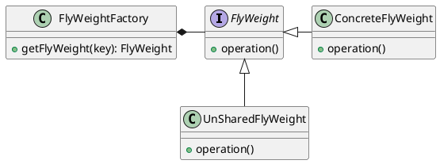

# 享元模式(Flyweight Pattern)


> 定义： 享元模式（Flyweight Pattern），又称轻量级模式（这也是其英文名为FlyWeight的原因），通过共享技术有效地实现了大量细粒度对象的复用。

**类型：** 结构型模式

**UML**




**角色说明**

- **FlyWeight:** 抽象接口或者抽象享元类，定义共享接口
- **ConcreteFlyWeight:** 具体享元类
- **UnSharedFlyWeight:** 非共享享元实现类
- **FlyWeightFactory:** 享元工厂类，控制实例的创建和共享

在`Java`语言中，`String`类型就是使用了享元模式。

`String`对象是`final`类型，对象一旦创建就不可改变。在Java中字符串常量都是存储在常量池中的，`Java`会确保一个字符串常量在常量池中只有一个拷贝。

**内部状态和外部状态**

- **内部状态(Internal State)：** 是存储在享元对象内部，一般在构造时确定或通过setter设置，并且不会随环境改变而改变的状态，因此内部状态可以共享
- **外部状态(External State)：** 是随环境改变而改变、不可以共享的状态。外部状态在需要使用时通过客户端传入享元对象。外部状态必须由客户端保存

## 享元模式示例

模拟一家咖啡馆正常经营的情况

**咖啡口味**
```java
public class CoffeeFlavour {

    /** name可认为是内部状态，在构造时确定 */
    private final String name;

    /** 使用弱引用，充当缓存，当发生gc的时候直接回收 */
    private static final WeakHashMap<String, CoffeeFlavour> CACHE = new WeakHashMap<>();

    /** only intern() can call this */
    private CoffeeFlavour(String name) {
        this.name = name;
    }

    @Override
    public String toString() {
        return name;
    }

    /**
     * 根据key从CACHE中获取value
     * @param name key
     * @return CoffeeFlavour
     */
    public static CoffeeFlavour intern(String name){
        synchronized (CACHE){
            return CACHE.computeIfAbsent(name, CoffeeFlavour::new);
        }
    }

    /**
     * 当前缓存CACHE的大小
     * @return int
     */
    public static int flavoursInCache(){
        synchronized (CACHE){
            return CACHE.size();
        }
    }
}
```

**订单处理类**
```java
@FunctionalInterface
public interface Order {
    /**
     * 服务
     */
    void serve();

    /**
     * 接收处理订单
     * @param flavourName 口味 （可认为是内部状态Internal State）
     * @param taleNumber 桌号 （可认为是外部状态External State）
     * @return
     */
    static Order of(String flavourName,int taleNumber){
        CoffeeFlavour flavour = CoffeeFlavour.intern(flavourName);
        return () -> System.out.println("Serving " + flavour + " to table " + taleNumber);
    }
}
```

**咖啡馆**
```java
public class CoffeeShop {
    private final ArrayList<Order> orders = new ArrayList<>();

    /**
     * 接收订单
     * @param flavour 口味
     * @param tableNumber 座位号
     */
    public void takeOrder(String flavour,int tableNumber){
        orders.add(Order.of(flavour, tableNumber));
    }

    /**
     * 处理订单
     */
    public void service(){
        orders.forEach(Order::serve);
    }
}
```

**客户端**
```java
public class FlyWeightExample {
    public static void main(String[] args) {
        // 1. 咖啡馆开始营业
        final CoffeeShop shop = new CoffeeShop();

        // 2. 接收订单
        shop.takeOrder("Cappuccino", 2);
        shop.takeOrder("Frappe", 1);
        shop.takeOrder("Espresso", 1);
        shop.takeOrder("Frappe", 897);
        shop.takeOrder("Cappuccino", 97);
        shop.takeOrder("Frappe", 3);
        shop.takeOrder("Espresso", 3);
        shop.takeOrder("Cappuccino", 3);
        shop.takeOrder("Espresso", 96);
        shop.takeOrder("Frappe", 552);
        shop.takeOrder("Cappuccino", 121);
        shop.takeOrder("Espresso", 121);

        // 3. 处理订单
        shop.service();

        // 4. 查看缓存
        System.out.println("CoffeeFlavor objects in cache: " + CoffeeFlavour.flavoursInCache());
    }
}
```

输出结果为:
```bash
Serving Cappuccino to table 2
Serving Frappe to table 1
Serving Espresso to table 1
Serving Frappe to table 897
Serving Cappuccino to table 97
Serving Frappe to table 3
Serving Espresso to table 3
Serving Cappuccino to table 3
Serving Espresso to table 96
Serving Frappe to table 552
Serving Cappuccino to table 121
Serving Espresso to table 121
CoffeeFlavor objects in cache: 3
```