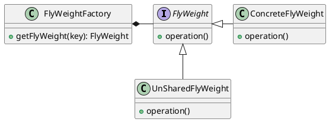
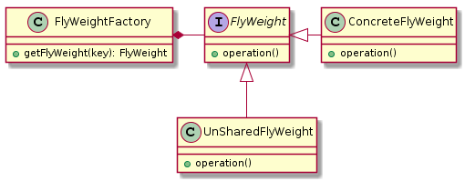

# 享元模式(Flyweight Pattern)


> 定义： 享元模式（Flyweight Pattern），又称轻量级模式（这也是其英文名为FlyWeight的原因），通过共享技术有效地实现了大量细粒度对象的复用。

**类型：** 结构型模式

**UML**






**角色说明**

- **FlyWeight:** 抽象接口或者抽象享元类，定义共享接口
- **ConcreteFlyWeight:** 具体享元类（或称为单纯享元模式）
- **UnSharedFlyWeight:** 非共享享元实现类（或称为复合享元模式）
- **FlyWeightFactory:** 享元工厂类，控制实例的创建和共享

在`Java`语言中，`String`类型就是使用了享元模式。

`String`对象是`final`类型，对象一旦创建就不可改变。在Java中字符串常量都是存储在常量池中的，`Java`会确保一个字符串常量在常量池中只有一个拷贝。

在`Integer.valueOf()`中有一个`IntegerCache` [-128, 127] ,同理`Long`中也一样

```java
System.out.println(Integer.valueOf(122)==Integer.valueOf(122));   // true
System.out.println(Integer.valueOf(128)==Integer.valueOf(128));  // false
```


**内部状态和外部状态**

- **内部状态(Internal State)：** 是存储在享元对象内部，一般在构造时确定或通过setter设置，并且不会随环境改变而改变的状态，因此内部状态可以共享
- **外部状态(External State)：** 是随环境改变而改变、不可以共享的状态。外部状态在需要使用时通过客户端传入享元对象。外部状态必须由客户端保存

## 单纯享元模式

在单纯享元模式中，所有的享元对象都是可以共享的。

## 复合享元模式

复合享元对象是由单纯享元对象通过复合而成的，因此可以提供`add()`这样的聚集管理方法。

由于一个复合享元对象具有不同的聚集元素，这些聚集元素在复合享元对象被创建之后加入，这本身就意味着复合享元对象的状态是会改变的，因此复合享元对象是不能共享的。 

复合享元角色实现了抽象享元角色所规定的接口，也就是`operation()`方法，这个方法有一个参数，代表复合享元对象的外蕴状态。

一个复合 享元对象的所有单纯享元对象元素的外蕴状态都是与复合享元对象的外蕴状态相等的；而一个复合享元对象所含有的单纯享元对象的内蕴状态一般是不相等的，不然 就没有使用价值了。

## 享元模式示例一

**FlyWeight**
```java
public interface FlyWeight {
    void operation(String external);
}
```

**ConcreteFlyWeight/UnSharedFlyWeight**
```java
public class ConcreteFlyWeight implements FlyWeight {

    private final String name;

    public ConcreteFlyWeight(String name) {
        this.name = name;
    }

    /**
     * 外部状态处理
     * @param external 外部状态
     */
    @Override
    public void operation( String external) {
        System.out.println("ConcreteFlyWeight Object = "+ this);
        System.out.println("Internal Status = " + name);
        System.out.println("External Status = " + external);
    }
}

public class UnSharedFlyWeight implements FlyWeight{
    /** 使用弱引用，充当缓存，当发生gc的时候直接回收 */
    private static final WeakHashMap<String, FlyWeight> CACHE = new WeakHashMap<>();

    public void add(String internal,FlyWeight flyWeight){
        synchronized (CACHE){
            CACHE.put(internal, flyWeight);
        }
    }

    @Override
    public void operation(final String external) {
        synchronized (CACHE){
            CACHE.values().forEach((flyWeight)-> flyWeight.operation(external));
        }
    }

    /**
     * 当前缓存CACHE的大小
     * @return int
     */
    public static int UnSharedFlyWeightInCache(){
        synchronized (CACHE){
            return CACHE.size();
        }
    }
}
```

**FlyWeightFactory**
```java
public final class FlyWeightFactory {

    private static Map<String, FlyWeight> pool = new ConcurrentHashMap<>(16);

    private FlyWeightFactory() {
    }

    /**
     * 获取复合享元
     * @param list 内部状态列表
     * @return UnSharedFlyWeight
     */
    public static FlyWeight getCompositeFlyweight(List<String> list){
        UnSharedFlyWeight unSharedFlyWeight = new UnSharedFlyWeight();
        for (final String internal:list){
            unSharedFlyWeight.add(internal,getFlyWeight(internal));
        }
        return unSharedFlyWeight;
    }

    /**
     * 获取单纯享元
     * @param internal 内部状态
     * @return FlyWeight
     */
    public static FlyWeight getFlyWeight(String internal) {
        // 根据key获取value，如果不存在则put
        return pool.computeIfAbsent(internal, ConcreteFlyWeight::new);
    }

    public static int poolSize(){
        return pool.size();
    }

}
```

**Client**
```java
public class Client {
    public static void main(String[] args) {

        List<String> internals = Arrays.asList("test1", "test2");

        // 单纯享元
        final FlyWeight concreteFlyWeight1 = FlyWeightFactory.getFlyWeight(internals.get(0));
        concreteFlyWeight1.operation("concreteFlyWeight1");
        final FlyWeight concreteFlyWeight2 = FlyWeightFactory.getFlyWeight(internals.get(0));
        concreteFlyWeight2.operation("concreteFlyWeight2");
        System.out.println(concreteFlyWeight1 == concreteFlyWeight2);
        System.out.println(FlyWeightFactory.poolSize());

        System.out.println("\n\n\n");

        // 复合享元
        final FlyWeight compositeFlyweight1 = FlyWeightFactory.getCompositeFlyweight(internals);
        final FlyWeight compositeFlyweight2 = FlyWeightFactory.getCompositeFlyweight(internals);
        compositeFlyweight1.operation("compositeFlyweight1");
        compositeFlyweight2.operation("compositeFlyweight2");
        System.out.println(compositeFlyweight1);
        System.out.println(compositeFlyweight2);
        System.out.println(compositeFlyweight1 == compositeFlyweight2);
        System.out.println(UnSharedFlyWeight.UnSharedFlyWeightInCache());
    }
}
```


## 享元模式示例二

模拟一家咖啡馆正常经营的情况

**咖啡口味**
```java
public class CoffeeFlavour {

    /** name可认为是内部状态，在构造时确定 */
    private final String name;

    /** 使用弱引用，充当缓存，当发生gc的时候直接回收 */
    private static final WeakHashMap<String, CoffeeFlavour> CACHE = new WeakHashMap<>();

    /** only intern() can call this */
    private CoffeeFlavour(String name) {
        this.name = name;
    }

    @Override
    public String toString() {
        return name;
    }

    /**
     * 根据key从CACHE中获取value
     * @param name key
     * @return CoffeeFlavour
     */
    public static CoffeeFlavour intern(String name){
        synchronized (CACHE){
            return CACHE.computeIfAbsent(name, CoffeeFlavour::new);
        }
    }

    /**
     * 当前缓存CACHE的大小
     * @return int
     */
    public static int flavoursInCache(){
        synchronized (CACHE){
            return CACHE.size();
        }
    }
}
```

**订单处理类**
```java
@FunctionalInterface
public interface Order {
    /**
     * 服务
     */
    void serve();

    /**
     * 接收处理订单
     * @param flavourName 口味 （可认为是内部状态Internal State）
     * @param taleNumber 桌号 （可认为是外部状态External State）
     * @return
     */
    static Order of(String flavourName,int taleNumber){
        CoffeeFlavour flavour = CoffeeFlavour.intern(flavourName);
        return () -> System.out.println("Serving " + flavour + " to table " + taleNumber);
    }
}
```

**咖啡馆**
```java
public class CoffeeShop {
    private final ArrayList<Order> orders = new ArrayList<>();

    /**
     * 接收订单
     * @param flavour 口味
     * @param tableNumber 座位号
     */
    public void takeOrder(String flavour,int tableNumber){
        orders.add(Order.of(flavour, tableNumber));
    }

    /**
     * 处理订单
     */
    public void service(){
        orders.forEach(Order::serve);
    }
}
```

**客户端**
```java
public class FlyWeightExample {
    public static void main(String[] args) {
        // 1. 咖啡馆开始营业
        final CoffeeShop shop = new CoffeeShop();

        // 2. 接收订单
        shop.takeOrder("Cappuccino", 2);
        shop.takeOrder("Frappe", 1);
        shop.takeOrder("Espresso", 1);
        shop.takeOrder("Frappe", 897);
        shop.takeOrder("Cappuccino", 97);
        shop.takeOrder("Frappe", 3);
        shop.takeOrder("Espresso", 3);
        shop.takeOrder("Cappuccino", 3);
        shop.takeOrder("Espresso", 96);
        shop.takeOrder("Frappe", 552);
        shop.takeOrder("Cappuccino", 121);
        shop.takeOrder("Espresso", 121);

        // 3. 处理订单
        shop.service();

        // 4. 查看缓存
        System.out.println("CoffeeFlavor objects in cache: " + CoffeeFlavour.flavoursInCache());
    }
}
```

输出结果为:
```bash
Serving Cappuccino to table 2
Serving Frappe to table 1
Serving Espresso to table 1
Serving Frappe to table 897
Serving Cappuccino to table 97
Serving Frappe to table 3
Serving Espresso to table 3
Serving Cappuccino to table 3
Serving Espresso to table 96
Serving Frappe to table 552
Serving Cappuccino to table 121
Serving Espresso to table 121
CoffeeFlavor objects in cache: 3
```

## 享元模式的优缺点

**优点：**
- 享元模式的外部状态相对独立，使得对象可以在不同的环境中被复用（共享对象可以适应不同的外部环境）
- 享元模式可共享相同或相似的细粒度对象，从而减少了内存消耗，同时降低了对象创建与垃圾回收的开销

**缺点：**
- 外部状态由客户端保存，共享对象读取外部状态的开销可能比较大
- 享元模式要求将内部状态与外部状态分离，这使得程序的逻辑复杂化，同时也增加了状态维护成本