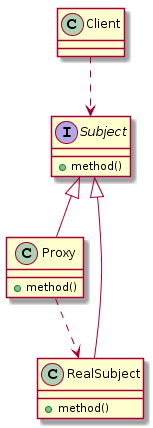

# 代理模式

> 定义: 代理是一个包装器或代理对象，客户端正在调用它来访问幕后的真实服务对象。使用代理可以简单地转发到真实对象，或者可以提供额外的逻辑。

> wiki:https://en.wikipedia.org/wiki/Proxy_pattern

> 类型: 结构型模式


> UML类图




## 代理模式实例

### 静态代理
**结构如下:**


**抽象主题角色(公共接口)**
```java
public interface Subject {
    /** 具体要做的事 */
    void method();
}
```

**具体主题角色(真正的处理对象)**
```java
public class RealSubject implements Subject{
    /** 具体要做的事 */
    @Override
    public void method() {
        System.out.println("do something...");
    }
}
```

**代理主题角色(代理类)**
```java
public class Proxy implements Subject{
    /** 要代理的对象 */
    private Subject subject;

    /** 初始化时传入需要被代理的对象 */
    public Proxy(Subject subject){
        this.subject = subject;
    }

    /** 具体做的事情,可以拓展为算法骨架(模板方法) */
    @Override
    public void method() {
        this.before();
        this.subject.method();
        this.after();
    }

    /** 代理之前做的事情 */
    public void before(){
        System.out.println(">>> Proxy Before...");
    }

    /** 代理结束做的事情 */
    public void after(){
        System.out.println(">>> Proxy After...");
    }
}
```

**客户端(业务类)**
```java
    public static void main(String[] args) {
        RealSubject realSubject = new RealSubject();
        Proxy proxy = new Proxy(realSubject);
        proxy.method();
        // >>> Proxy Before...
        // do something...
        // >>> Proxy After...        
    }
```

## 动态代理


