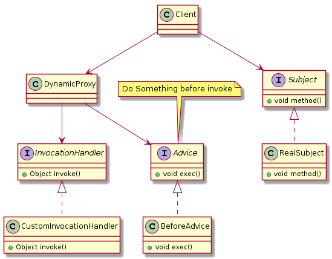

# 代理模式

> 定义: 代理是一个包装器或代理对象，客户端正在调用它来访问幕后的真实服务对象。使用代理可以简单地转发到真实对象，或者可以提供额外的逻辑。

> wiki:https://en.wikipedia.org/wiki/Proxy_pattern

> 类型: 结构型模式


> UML类图


## 代理模式实例

### 静态代理

**结构如下:**


**抽象主题角色(公共接口)**
```java
public interface Subject {
    /** 具体要做的事 */
    void method();
}
```

**具体主题角色(真正的处理对象)**

```java
public class RealSubject implements Subject{
    /** 具体要做的事 */
    @Override
    public void method() {
        System.out.println("do something...");
    }
}
```

**代理主题角色(代理类)**
```java
public class Proxy implements Subject{
    /** 要代理的对象 */
    private Subject subject;

    /** 初始化时传入需要被代理的对象 */
    public Proxy(Subject subject){
        this.subject = subject;
    }

    /** 具体做的事情,可以拓展为算法骨架(模板方法) */
    @Override
    public void method() {
        this.before();
        this.subject.method();
        this.after();
    }

    /** 代理之前做的事情 */
    public void before(){
        System.out.println(">>> Proxy Before...");
    }

    /** 代理结束做的事情 */
    public void after(){
        System.out.println(">>> Proxy After...");
    }
}
```

**客户端(业务类)**
```java
    public static void main(String[] args) {
        RealSubject realSubject = new RealSubject();
        Proxy proxy = new Proxy(realSubject);
        proxy.method();
        // >>> Proxy Before...
        // do something...
        // >>> Proxy After...        
    }
```

## 动态代理

例如面向横切面编程-`AOP(Aspect Oriented Programming)`中就运用了动态代理机制.

### JDK实现

**UML**




#### 真正执行的主题

```java
public interface Subject {
    void method();
}

public class RealSubject implements Subject{

    @Override
    public void method() {
        System.out.println("do something...");
    }
}
```

#### 消息通知

```java
public interface Advice {
    void exec();
}

public class BeforeAdvice implements Advice {
    @Override
    public void exec() {
        System.out.println(">>> BeforeAdvice working...");
    }
}
```

#### 实现JDK的InvocationHandler
```java
public class CustomInvocationHandler implements InvocationHandler{

    // 被代理的对象
    private Object target;

    public CustomInvocationHandler(Object target) {
        this.target = target;
    }

    @Override
    public Object invoke(Object proxy, Method method, Object[] args) throws Throwable {
        // proxy为生成的代理类
        // 调用被代理的对象的具体方法，以及传入参数
        return method.invoke(this.target,args);
    }
}
```

#### 动态代理类

```java
public final class DynamicProxy {

    /** 前置通知 */
    private static final Advice beforeAdvice = new BeforeAdvice();

    public static <T extends Subject> T newProxyInstance(Subject target){

        beforeAdvice.exec();
        
        // 传入 被代理类的类加载器ClassLoader | 被代理对象的实现接口 | InvocationHandler
        
        //noinspection unchecked
        return (T) Proxy.newProxyInstance(target.getClass().getClassLoader(),target.getClass().getInterfaces(),new CustomInvocationHandler(target));
        // 也可用lombda表达式  
        //return (T) Proxy.newProxyInstance(target.getClass().getClassLoader(), target.getClass().getInterfaces(), (proxy, method, args) -> method.invoke(target, args));
    }
}
```

#### 场景类
```java
public class Client {
    public static void main(String[] args) {
        final Subject o = DynamicProxy.newProxyInstance(new RealSubject());
        o.method();
        // >>> BeforeAdvice working...
        // do something...
    }
}
```


## 几种代理的对比

| 代理方式        | 具体实现   |  优点  | 缺点| 底层
| --------   | :----  | :----  | :----|:----|
| 静态代理     | 代理类与委托类实现同一接口<br>在代理类中需要硬编码接口 |   实现简单<br>容易理解    | 代理类需要硬编码接口<br>在实际应用中可能会导致重复编码<br>浪费存储空间并且效率很低|
| JDK动态代理     |   代理类与委托类实现同一接口<br>主要是通过代理类实现`InvocationHandler`并重写`invoke`方法来进行动态代理<br>在invoke方法中将对方法进行增强处理   |   不需要硬编码接口<br>代码复用率高   |只能够代理实现了接口的委托类|用反射机制进行方法的调用|
| CGLIB动态代理   |   代理类将委托类作为自己的父类并为其中的`非final`委托方法创建两个方法<br>一个是与委托方法签名相同的方法，它在方法中会通过super调用委托方法<br>另一个是代理类独有的方法<br>在代理方法中，它会判断是否存在实现了`MethodInterceptor`接口的对象，若存在则将调用`intercept`方法对委托方法进行代理|  可以在运行时对类或者是接口进行增强操作<br>委托类无需实现接口  |不能对`final类`以及`final方法`进行代理|底层将方法全部存入一个数组中,<br>通过数组索引直接进行方法调用|
