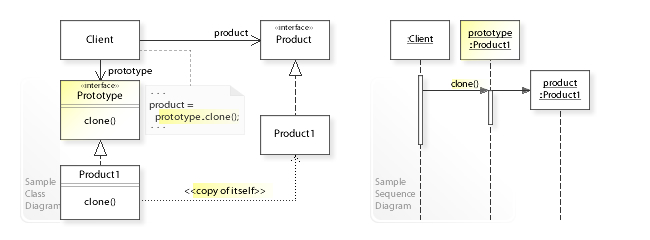
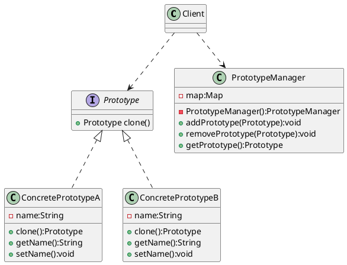
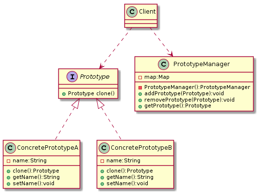

# 原型模式(Prototype Pattern)

> wiki:




> 类型： 创建型

> 何时使用： 当直接创建对象的代价比较大时，则采用这种模式

> UML


原型设计模式解决了以下问题：

- 如何创建对象以便在运行时指定要创建的对象？
- 如何动态加载类的实例化

原型设计模式描述了如何解决这些问题：

- 定义一个`Prototype`返回自身副本的对象。
- 通过复制`Prototype`对象创建新对象。

原型模式的注意事项: 

- 使用原型模式复制对象不会调用类的构造方法。
- 单例模式中，只要将构造方法的访问权限设置为private型，就可以实现单例。但是clone方法直接无视构造方法的权限，所以，单例模式与原型模式是冲突的，在使用时要特别注意。
- `浅拷贝`: Object类的clone方法只会拷贝对象中的基本的数据类型，对于数组、容器对象、引用对象等都不会拷贝
- `深拷贝`: 将原型模式中的数组、容器对象、引用对象等另行拷贝
- 因为是从内存中直接

## 原型模式实例

**抽象原型角色**

```java
public abstract class Prototype implements Cloneable{
    @Override
    public Object clone() throws CloneNotSupportedException {
        return super.clone();
    }
}
```

**具体原型角色**

```java
public class ConcretePrototype1 extends Prototype {
    @Override
    public Object clone() throws CloneNotSupportedException {
        return super.clone();
    }
}

public class ConcretePrototype2 extends Prototype {
    private ArrayList list = new ArrayList();

    /**
     * 由于Clone不会调用构造函数，可用来查看差别
     */
    public ConcretePrototype2() {
        System.out.println("ConcretePrototype2 init...");
        this.list.add("Hello World!");
    }

    public ArrayList getList() {
        return list;
    }

    public void setList(ArrayList list) {
        this.list = list;
    }

    @Override
    public Object clone() throws CloneNotSupportedException {
        ConcretePrototype2 clone = (ConcretePrototype2)super.clone();
        // 深度拷贝
        clone.setList((ArrayList) this.getList().clone());
        return clone;
    }
}
```

**场景类**
```java
public class Client {
    public static void main(String[] args) throws CloneNotSupportedException {
        // 测试克隆
        ConcretePrototype1 concretePrototype1 = new ConcretePrototype1();
        System.out.println(concretePrototype1);
        System.out.println(concretePrototype1.clone());

        System.out.println();

        ConcretePrototype2 concretePrototype2 = new ConcretePrototype2();
        System.out.println(concretePrototype2);
        final ConcretePrototype2 clone = (ConcretePrototype2)concretePrototype2.clone();
        System.out.println(clone);
        System.out.println(concretePrototype2.getList());
        System.out.println(clone.getList());


        // 测试性能
        System.out.println();
        int count = 10000;
        long startTmie = System.currentTimeMillis();
        for (int i = 0;i<count;i++){
            new ConcretePrototype2();
        }
        long endTime = System.currentTimeMillis();
        System.out.println("new cost :"+(endTime-startTmie)+"ms");
        // new cost :48ms


        startTmie = System.currentTimeMillis();
        for (int i = 0;i<count;i++){
           concretePrototype2.clone();
        }
        endTime = System.currentTimeMillis();
        System.out.println("prototype cost :"+(endTime-startTmie)+"ms");
        // prototype cost :2ms
    }
}
```

## 带Prototype Manager的原型模式(登记形式的原型模型)

- 从缓存（MAP）中获取
- 可使用HashTable或者ConcurrentHashMap
- 如果使用HashMap需要考虑加锁，或者`Collections.synchronizeMap(hashMap);`使其同步


**UML**





**抽象原型接口**

```java
public interface Prototype {
    /**
     * 自定义克隆（可使用第三方序列化方式）
     * @return Prototype
     */
    Prototype clone();

    /**
     * 标识
     * @return id
     */
    String id();
}
```

**具体原型对象**
```java
public class ConcretePrototypeA implements Prototype{
    private String name;

    public ConcretePrototypeA(String name) {
        this.name = name;
    }

    public String getName() {
        return name;
    }

    public void setName(String name) {
        this.name = name;
    }

    @Override
    public Prototype clone() {
        // 自定义克隆，此处可新建或者使用第三方序列化
        return new ConcretePrototypeA(this.getName());
    }

    @Override
    public String id() {
        return this.name;
    }
}

public class ConcretePrototypeB implements Prototype{
    private String name;

    public ConcretePrototypeB(String name) {
        this.name = name;
    }

    public String getName() {
        return name;
    }

    public void setName(String name) {
        this.name = name;
    }

    @Override
    public Prototype clone() {
        // 自定义克隆，此处可新建或者使用第三方序列化
        return new ConcretePrototypeB(this.getName());
    }

    @Override
    public String id() {
        return this.name;
    }
}
```

**PrototypeManager**
```java
public class PrototypeManager {
    private static Map<String,Prototype> map = new ConcurrentHashMap();

    /** 防止外部初始化，保证只有一个实例 */
    private PrototypeManager() {}

    public static void addPrototype(Prototype prototype){
        map.put(prototype.id(), prototype);
    }

    public static void removePrototype(Prototype prototype){
        map.remove(prototype.id());
    }

    /**
     * 获取原始对象
     * @param id 标识
     * @return Prototype
     */
    public static Prototype getPrototype(String id){
        return map.get(id);
    }

    /**
     * 获取拷贝对象
     * @param id 标识
     * @return Prototype
     */
    public static Prototype getPrototypeClone(String id){
        return map.get(id).clone();
    }
}
```

**场景类**
```java
public class Client {
    public static void main(String[] args) {
        Prototype prototypeA = new ConcretePrototypeA("ConcretePrototypeA");
        Prototype prototypeB = new ConcretePrototypeB("ConcretePrototypeB");

        PrototypeManager.addPrototype(prototypeA);
        PrototypeManager.addPrototype(prototypeB);

        System.out.println(prototypeA);
        System.out.println(PrototypeManager.getPrototype("ConcretePrototypeA"));
        System.out.println(PrototypeManager.getPrototypeClone("ConcretePrototypeA"));
        //  ConcretePrototypeA@60e53b93
        //  ConcretePrototypeA@60e53b93
        //  ConcretePrototypeA@5e2de80c
    }
}
```


## 原型模式的优缺点

**优点：**

- 性能提高（直接操作内存中的二进制流）
- 逃避构造函数的约束

**缺点：**

- 必须实现 Cloneable 接口
- 需要为每一个类配置一个克隆方法，而且该克隆方法位于类的内部，当对已有类进行改造的时候，需要修改代码，违反了开闭原则。
- 在实现深克隆时需要编写较为复杂的代码，而且当对象之间存在多重签到引用时，为了实现深克隆，每一层对象对应的类都必须支持深克隆，实现起来会比较麻烦。


