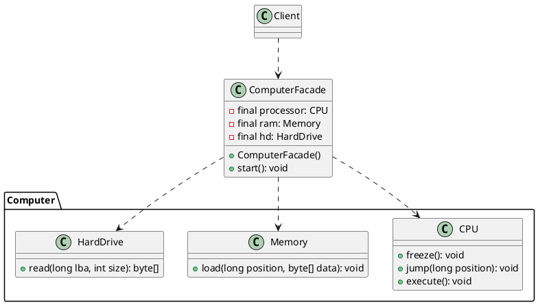
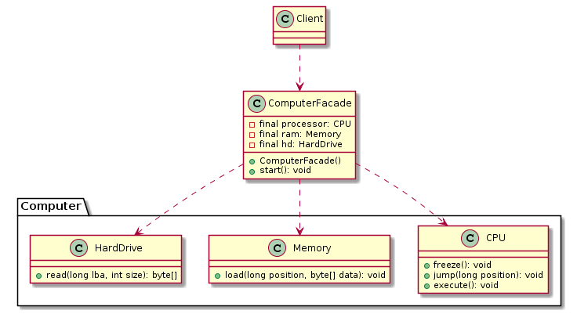

# 外观模式(Facade Pattern)


> 外观模式：为子系统中的一组接口提供一个统一的入口。外观模式定义了一个高层接口，这个接口使得这一子系统更加容易使用。  
> Facade Pattern: Provide a unified interface to a set of interfaces in a subsystem. Facade defines a higher-level interface that makes the subsystem easier to use.

> 类型： 结构型

#### Facade Pattern 可以解决哪些问题?

- 为了使复杂的子系统更易于使用，应为子系统中的一组接口提供简单的接口。
- 系统非常复杂或难以理解，每个级别的分层软件都需要一个入口点，或者子系统的抽象和实现是紧密耦合的。

#### Facade Pattern描述了什么解决方案?

- 根据（通过委托）子系统中的接口实现一个简单的接口.
- 可以在转发请求之前/之后执行附加功能。

#### 用法

- 当需要更简单或更简单的底层对象接口时，使用`Facade`。
- 或者，当包装器必须遵循特定接口并且必须`支持多态行为`时，可以使用`适配器`。
- 一个装饰使得可以添加或更改在运行时的(接口/方法)的行为。

#### 几种对比

| Pattern        | Intent   | 
| --------   | :-----  | 
| Adapter     | Converts one interface to another so that it matches what the client is expecting |   
| Decorator        |  Dynamically adds responsibility to the interface by wrapping the original code   |  
| Facade        |    Provides a simplified interface    | 


#### UML


## Facade Pattern例子

#### UML





#### 子系统部分

```java
public class CPU {

    public void freeze(){
        System.out.println("CPU freeze...");
    }

    public void jump(long position){
        System.out.println("CPU jump to "+position);
    }

    public void execute(){
        System.out.println("CPU execute...");
    }
}

public class Memory {

    public void load(long position,byte[] data){
        System.out.println("Memory at "+ position+" load data :"+data);
    }
}

public class HardDrive {

    public byte[] read(long lba, int size){
        System.out.println("HardDrive read "+lba+" size:"+size);
        return new byte[]{0X000000};
    }
}
```

#### Facade类

```java
public class ComputerFacade {

    private final static long BOOT_ADDRESS = 0X000000;

    /** 磁盘地址 */
    private final static long BOOT_SECTOR = 0X0000c;
    /** 磁盘大小 */
    private final static int SECTOR_SIZE = 8225280;

    private final CPU processor;

    private final Memory ram;

    private final HardDrive hd;

    public ComputerFacade() {
        this.processor = new CPU();
        this.ram = new Memory();
        this.hd = new HardDrive();
    }

    public void start() {
        // cpu解冻
        processor.freeze();
        // 内存加载
        ram.load(BOOT_ADDRESS, hd.read(BOOT_SECTOR, SECTOR_SIZE));
        processor.jump(BOOT_ADDRESS);
        processor.execute();
    }
}
```

#### 场景类

```java
public class Client {
    public static void main(String[] args) {
        ComputerFacade computer = new ComputerFacade();
        computer.start();
        // CPU freeze...
        // HardDrive read 12 size:8225280
        // Memory at 0 load data :[B@2b193f2d
        // CPU jump to 0
        // CPU execute...
    }
}
```