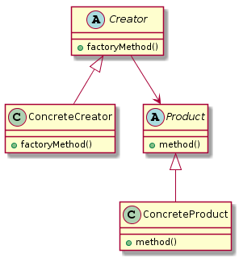
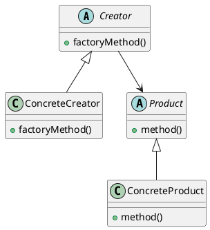
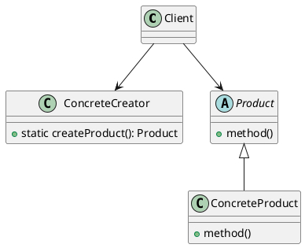
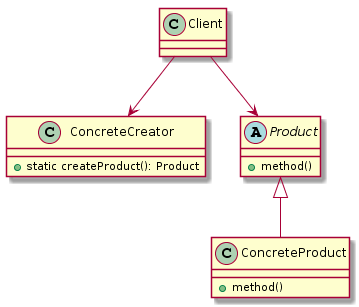
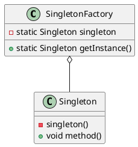
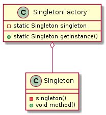

# 工厂模式
什么是工厂？批量加工我需要的产品(对象)

> Define an interface for creating an object, but let subclasses decide which class to instance.  
> Factory Method lets a class defer instantiation to subclass.

**UML类图:**






面向对象设计的基本原则：
- `OCP`(开闭原则, `Open-Closed Principle`)：一个软件的实体应当对扩展开放，对修改关闭。

- `DIP`(依赖倒转原则,`Dependence Inversion Principle`)：要针对接口编程，不要针对实现编程。

- `LoD`(迪米特法则, `Law of Demeter`)：只与你直接的朋友通信，而避免和陌生人通信。


## 工厂方法模式实例

**抽象产品类**

```java
public abstract class Product {
    /** 公共方法 */
    public void commonMethod() {
        System.out.println("Hello world!");
    }
    
    /** 具体方法延迟到子类 */
    public abstract void method();
}
```

**具体产品类**

```java
public class ConcreteProduct extends Product {
    @Override
    public void method() {
        System.out.println("doing something...");
    }
}
```

**抽象工厂类(Creator)**

```java
public abstract class Creator {
    /**
     * 创建一个产品对象
     * @param cls 产品具体类
     * @param <T>  产品类型 设置为Product的子类
     * @return <T extends Product>
     */
    public abstract <T extends Product> T createProduct(Class<T> cls);
}
```

**具体工厂类**

```java
public class ConcreteCreator extends Creator {
    @Override
    public <T extends Product> T createProduct(Class<T> cls) {
        Product product = null;
        try {
            // Class.newInstance
            // 调用的而是类的不带参数的构造方法
            product = (Product) Class.forName(cls.getName()).newInstance();
        } catch (InstantiationException | IllegalAccessException | ClassNotFoundException e) {
            e.printStackTrace();
        }
        // noinspection unchecked
        return (T) product;
    }
}
```

**客户端(使用者)**

```java
    public static void main(String[] args) {
        Creator creator = new ConcreteCreator();
        final ConcreteProduct product = creator.createProduct(ConcreteProduct.class);
        product.commonMethod();
        product.method();
    }
```

## 简单工厂(Simple Factory)
有时候我们的`产品(对象)`可能只需要一个`工厂类`,于是使用静态方法就行

**UML类图如下:**






**抽象产品类**

```java
public abstract class Product {
    /** 公共方法 */
    public void commonMethod() {
        System.out.println("Hello world!");
    }
    
    /** 具体方法延迟到子类 */
    public abstract void method();
}
```

**具体产品类**

```java
public class ConcreteProduct extends Product {
    @Override
    public void method() {
        System.out.println("doing something...");
    }
}
```

**简单工厂类**

```java
public class ConcreteCreator {
    public static <T extends Product> T createProduct(Class<T> cls){
        Product product = null;
        try {
            // Class.newInstance调用的而是类的不带参数的构造方法
            product = (Product) Class.forName(cls.getName()).newInstance();
        } catch (InstantiationException e) {
            e.printStackTrace();
        } catch (IllegalAccessException e) {
            e.printStackTrace();
        } catch (ClassNotFoundException e) {
            e.printStackTrace();
        }
        // noinspection unchecked
        return (T) product;
    }
}
```

**客户端(使用者)**

```java
    public static void main(String[] args) {
        final ConcreteProduct product = ConcreteCreator.createProduct(ConcreteProduct.class);
        product.commonMethod();
        product.method();
    }
```


## 工厂方法模式代替单例模式

如何使用工厂方法模式实现单例模式的功能呢?单例不允许通过正常渠道创建对象,所以我们可以通过`反射的方式`来创建.


**UML类图:**





**需要处理为单例对象的类**
```java
public class Singleton {
    
    /** 约定将构造方法设置为private */
    private Singleton(){}

    public void say(){
        System.out.println("Hello World!");
    }
}
```

**单例工厂**
```java
public class SingletonFactory {
    private static Singleton singleton;

    static {
        try {
            final Class cls = Class.forName(Singleton.class.getName());
            final Constructor constructor = cls.getDeclaredConstructor();

            // 将构造函数设置为可访问
            constructor.setAccessible(true);

            singleton = (Singleton) constructor.newInstance();

        } catch (ClassNotFoundException e) {
            e.printStackTrace();
        } catch (NoSuchMethodException e) {
            e.printStackTrace();
        } catch (IllegalAccessException e) {
            e.printStackTrace();
        } catch (InstantiationException e) {
            e.printStackTrace();
        } catch (InvocationTargetException e) {
            e.printStackTrace();
        }
    }

    public static Singleton getInstance(){
        return singleton;
    }
}
```

**具体调用**

```java
    public static void main(String[] args) {
        SingletonFactory.getInstance().say();
    }
```

## 实例部分
###  简单工厂
```java
public abstract class Coffee {
    // 咖啡名字 (此处为为缺省default修饰,在同一包内可见)
    abstract String getName();
}
```

```java
public class LatteCoffee extends Coffee {
    @Override
    String getName() {
        // LatteCoffee
        return "LatteCoffee";
    }
}
```

```java
public class SimpleFactory {
    public static Coffee createCoffee(Class clazz){
        if (Coffee.class.equals(clazz)){
            return new LatteCoffee();
        } else {
            throw new RuntimeException("none");
        }
    }
}
```

利用反射实现
```java
public class StaticFactory {
    // 返回继承于Coffee类型的对象
    public static <T extends Coffee> T createCoffee(Class<T> clazz){
        try {
            // 利用反射进行初始化
            return (T) Class.forName(clazz.getName()).newInstance();
        } catch (Exception e){
            e.printStackTrace();
            System.out.println("error happened when instance!");
        }
        return null;
    }
}
```

多方法静态工厂(类似Executor类)
```java
public class ManyStaticFactory {
    // 模仿Executor类 方便创建 同种类型的 复杂参数 对象
    public static Coffee createLatte(){
        return new LatteCoffee();
    }
    ...
}
```

### 工厂方法

将类的初始化推迟到子类(抽象工厂 -> 具体工厂 )

```java
public abstract class CoffeeFactory {
    // 制造咖啡
   public abstract String createCoffee();
}
```

```java
public class LatteCoffeeFactory extends CoffeeFactory {
    @Override
    public String createCoffee() {
        // LatteCoffee
        return "LatteCoffee";
    }
}
```

```java
public class FactoryMethod {
    public static void main(String[] args) {
        CoffeeFactory coffeeFactory = new LatteCoffeeFactory();
        System.out.println(coffeeFactory.createCoffee());
    }
}
```

### 抽象工厂

#### 饮料抽象
```java
/**
 * 抽象饮料类
 * @author Xin Chen (xinchenmelody@gmail.com)
 * @date: Created In 2018/5/29 22:29
 */
public abstract class Beverage {
    // 抽象方法饮料名
   public abstract String getName();
}
```

```java
public class LatteCoffee extends Beverage {
    @Override
    public String getName() {
        // LatteCoffee
        return "LatteCoffee";
    }
}
```

```java
public class Tea extends Beverage{
    @Override
    public String getName() {
        // Tea
        return "Tea";
    }
}
```

#### 工厂抽象
```java
/**
 * 抽象工厂方法
 * @author Xin Chen (xinchenmelody@gmail.com)
 * @date: Created In 2018/5/29 23:35
 */
public abstract class AbstractFactory {
    // 制造咖啡
    public abstract LatteCoffee createCoffee();
    public abstract <T extends LatteCoffee> T createCoffee(Class<T> clazz);

    // 制造茶
    public abstract Tea createTea();
    public abstract <T extends Tea> T createTea(Class<T> clazz);
}
```

```java
/**
 * 星巴克工厂
 * @author Xin Chen (xinchenmelody@gmail.com)
 * @date: Created In 2018/5/30 0:00
 */
public class StarbucksFactory extends AbstractFactory{
    @Override
    public LatteCoffee createCoffee() {
        return new LatteCoffee();
    }

    @Override
    public <T extends LatteCoffee> T createCoffee(Class<T> clazz) {
        try {
            return (T) Class.forName(clazz.getName()).newInstance();
        } catch (Exception e){
            e.printStackTrace();
            System.out.println("error happened when LatteCoffee instance!");
        }
        return null;
    }

    @Override
    public Tea createTea() {
        return new Tea();
    }

    @Override
    public <T extends Tea> T createTea(Class<T> clazz) {
        try {
            return (T) Class.forName(clazz.getName()).newInstance();
        } catch (Exception e){
            e.printStackTrace();
            System.out.println("error happened when Tea instance!");
        }
        return null;
    }
}
```

测试代码
```java
    public static void main(String[] args) {
        // AbstractFactory starbucksFactory = new StarbucksFactory();
        StarbucksFactory starbucksFactory = new StarbucksFactory();
        System.out.println(starbucksFactory.createTea().getName());
        System.out.println(starbucksFactory.createTea(Tea.class).getName());

        System.out.println(starbucksFactory.createCoffee().getName());
        System.out.println(starbucksFactory.createCoffee(LatteCoffee.class).getName());
    }
```
