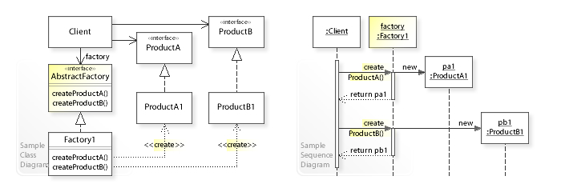
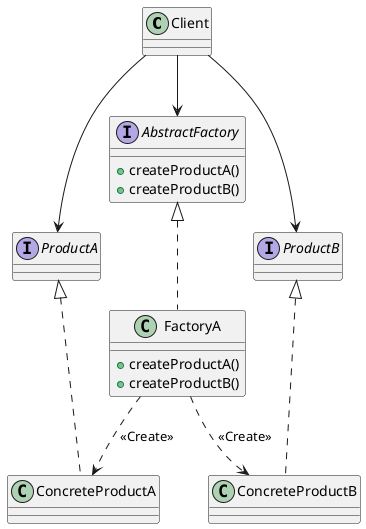
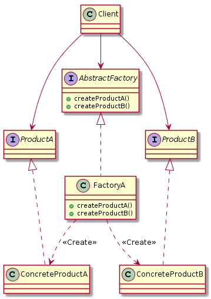

# 抽象工厂模式(Abstract Factory Pattern)

> wiki: The abstract factory pattern provides a way to encapsulate a group of individual factories that have a common theme without specifying their concrete classes.




> 提供一个创建一系列相关或相互依赖对象的接口，而无需指定它们具体的类。

> 主要解决：主要解决接口选择的问题。

> 何时使用：系统的产品有多于一个的产品族，而系统只消费其中某一族的产品。

> 与工厂方法模式的区别为： 工厂方法是由子类自行决定实例化那个类，而抽象工厂是自己决定实例化哪个类。


抽象工厂设计模式解决了以下问题：

- 应用程序如何独立于其对象的创建方式？
- 一个类如何独立于它所需的对象来创建？
- 如何创建相关或依赖对象的族？

抽象工厂设计模式描述了如何解决这些问题:

- 将对象创建封装在单独的（工厂）对象中。也就是说，定义一个用于创建对象的接口（AbstractFactory），并实现该接口。
- 类将对象创建委托给工厂对象，而不是直接创建对象。

## 抽象工厂实例

**UML：**





**产品抽象接口**

```java
public interface ProductA {
}
public interface ProductB {
}
```

**具体产品实现类**

```java
public class ConcreteProductA implements ProductA{
    public ConcreteProductA() {
        System.out.println("init ConcreteProductA...");
    }
}
public class ConcreteProductB implements ProductB{
    public ConcreteProductB() {
        System.out.println("init ConcreteProductB...");
    }
}
```


**抽象工厂接口**

```java
public interface AbstractFactory {
    /**
     * 创建产品A
     * @param cls 具体产品类
     * @param <T> 具体产品类
     * @return 具体产品类A
     */
    <T extends ProductA> T createProductA(Class<T> cls);
    /**
     * 创建产品B
     * @param cls 具体产品类
     * @param <T> 具体产品类
     * @return 具体产品类AB
     */
    <T extends ProductB> T createProductB(Class<T> cls);
}
```

**具体工厂类**

```java
public class FactoryA implements AbstractFactory{
    @Override
    public <T extends ProductA> T createProductA(Class<T> cls) {
        if (null != cls){
            try {
                final Object o = Class.forName(cls.getName()).newInstance();
                // noinspection unchecked
                return (T) o;
            } catch (InstantiationException e) {
                e.printStackTrace();
            } catch (IllegalAccessException e) {
                e.printStackTrace();
            } catch (ClassNotFoundException e) {
                e.printStackTrace();
            }
        }
        return null;
    }

    @Override
    public <T extends ProductB> T createProductB(Class<T> cls) {
        if (null != cls){
            try {
                final Object o = Class.forName(cls.getName()).newInstance();
                // noinspection unchecked
                return (T) o;
            } catch (InstantiationException | IllegalAccessException | ClassNotFoundException e) {
                e.printStackTrace();
            }
        }
        return null;
    }
}
```

**场景类**

```java
public class Client {
    public static void main(String[] args) {
        AbstractFactory factory = new FactoryA();

        final ConcreteProductA productA = factory.createProductA(ConcreteProductA.class);
        final ConcreteProductB productB = factory.createProductB(ConcreteProductB.class);
        // init ConcreteProductA...
        // init ConcreteProductB...
    }
}
```

## 抽象工厂模式的优缺点

**优点：**

- 抽象工厂模式隔离了具体类的生产，使得客户并不需要知道什么被创建。
- 当一个产品族中的多个对象被设计成一起工作时，它能保证客户端始终只使用同一个产品族中的对象。
- 增加新的具体工厂和产品族很方便，无须修改已有系统，符合“开闭原则”。

**缺点：**

- 产品族扩展非常困难，要增加一个系列的某一产品，既要在抽象的 Creator 里加代码，又要在具体的里面加代码。

## 抽象工厂和工厂方法的对比

|工厂方法模式|抽象工厂模式|
|:---|:---|
|针对的是一个产品等级结构|针对的是面向多个产品(产品族)等级结构|
|一个抽象产品类|多个抽象产品类|
|可以派生出多个具体产品类|每个抽象产品类可以派生出多个具体产品类|
|一个抽象工厂类，可以派生出多个具体工厂类|一个抽象工厂类，可以派生出多个具体工厂类|
|每个具体工厂类只能创建一个具体产品类的实例|每个具体工厂类可以创建多个具体产品类的实例|


**简单工厂模式：** 他的最大优点就是在于工厂类包含了必要的逻辑判断，根据客户端的选择条件动态实例化相关的类，对于客户端来说，去除了与具体产品的依赖，当算法比较稳定，一般不会对它进行新增，或删除等就适合用词模式；否则就会违背了“开放-封闭”原则

**工厂方法模式：** 它定义了用于创建对象的接口，让子类决定实例化哪一个类，工厂方法使一个类的实例化延迟到其子类。

**抽象工厂模式：** 当产品有不同的系列，而不同的系列又有不同的创建方式，此时就适合用此模式