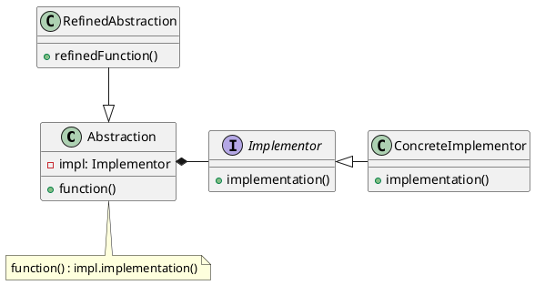
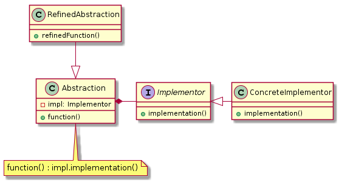
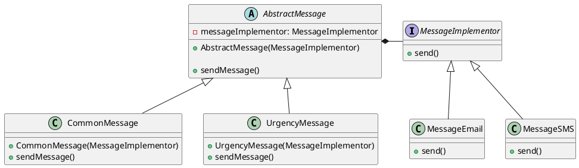
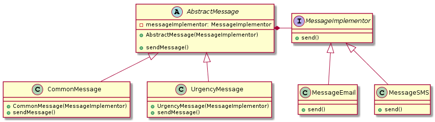

# 桥接模式(Bridge Pattern)


> 定义： 将抽象部分与实现部分分离，使他们可以独立的变化。

**类型：** 结构型模式

**UML**






**角色定义**

- **Abstraction(abstract class)-抽象类：** 定义抽象接口，持有/维持 implementor 的引用
- **RefinedAbstraction(normal class)-正常的类：** 拓展由Abstraction定义的接口
- **Implementor(interface)-执行者：** 定义执行者的接口
- **ConcreteImplementor(normal class)-具体类:** 实现Implementor接口


**Bridge设计模式可以解决哪些问题？**

- 抽象及其实现应该彼此独立地定义和扩展。
- 避免抽象及其实现之间的编译时绑定，以便可以在运行时选择实现。

使用子类时，不同的子类以不同的方式实现抽象类。但是实现在编译时绑定到抽象，并且不能在运行时更改。


## 桥接模式实例一

模拟账号操作记录日志

**Implementor(Logger.java)**
```java
@FunctionalInterface
public interface Logger {

    /**
     * 打印日志
     * @param message message
     */
    void log(String message);

    /**
     * info级别日志
     * @return LOGGER
     */
    static Logger info(){
        return message -> System.out.println("info: " + message);
    }

    /**
     * warn级别日志
     * @return LOGGER
     */
    static Logger warning(){
        return message -> System.out.println("warning: " + message);
    }
}
```

**Abstraction(AbstractAccount.java)**
```java
public class AbstractAccount {
    /** 自定义日志 支持 info/warn */
    private Logger logger = Logger.info();

    /**
     * 设置打印的日志
     * @param logger Logger
     */
    public void setLogger(Logger logger) {
        this.logger = logger;
    }

    /**
     * 操作记录
     * @param message 信息
     * @param action 结果
     */
    protected void operate(String message, BooleanSupplier action) {
        boolean result = action.getAsBoolean();
        logger.log(message + " result " + result);
    }
}
```

**RefinedAbstraction(SimpleAccount.java)**
```java
public class SimpleAccount extends AbstractAccount {

    /**
     * 余额
     */
    private int balance;

    /**
     * 初始化账号余额
     *
     * @param balance balance
     */
    public SimpleAccount(int balance) {
        this.balance = balance;
    }

    /**
     * 判断是否快余额不足
     * 判断条件为小于50
     *
     * @return boolean
     */
    public boolean isBalanceLow() {
        return this.balance < 50;
    }

    /**
     * 取出余额
     *
     * @param amount 数量
     */
    public void withdraw(int amount) {
        operate("withdraw " + amount, () -> {
            if (this.balance >= amount) {
                this.balance -= amount;
                return true;
            }
            return false;
        });
    }

}
```

**Client**
```java
public class BridgeDemo {
    public static void main(String[] args) {
        // 1. 初始化账号
        SimpleAccount account = new SimpleAccount(100);

        // 2. 取出75
        account.withdraw(75);
        // info: withdraw 75 result true

        // 3. 判断余额是否已经到警戒值，切换日志级别
        if (account.isBalanceLow()){
            account.setLogger(Logger.warning());
        }

        // 4. 取出10
        account.withdraw(10);
        // warning: withdraw 10 result true

        // 5. 取出100
        account.withdraw(100);
        // warning: withdraw 100 result false
    }
}
```

## 桥接模式实例二

模拟消息的发送

**UML**





**Implementor接口**
```java
public interface MessageImplementor {
    /**
     * 发送消息
     * @param message 消息
     * @param to 发送对象
     */
    void send(String message, String to);

}
```

**ConcreteImplementor具体实现**
```java
public class MessageEmail implements MessageImplementor{
    @Override
    public void send(String message, String to) {
        System.out.println(String.format("发送邮件消息 {%s} to {%s}", message, to));
    }
}

public class MessageSMS implements MessageImplementor {
    @Override
    public void send(String message, String to) {
        System.out.println(String.format("发送短信消息 {%s} to {%s}", message, to));
    }
}
```

**Abstraction**
```java
public abstract class AbstractMessage {
    /** 消息发送接口 */
    MessageImplementor messageImplementor;

    /**
     * 初始化时传入具体实现
     * @param messageImplementor 消息发送
     */
    public AbstractMessage(MessageImplementor messageImplementor) {
        this.messageImplementor = messageImplementor;
    }

    /**
     * 发送消息，委派给MessageImplementor的具体实现
     * @param message 消息
     * @param to 发送对象
     */
    public void sendMessage(String message,String to){
        this.messageImplementor.send(message,to);
    }
}
```

**RefinedAbstraction**
```java
public class CommonMessage extends AbstractMessage{
    /**
     * 初始化时传入具体实现
     *
     * @param messageImplementor 消息发送
     */
    public CommonMessage(MessageImplementor messageImplementor) {
        super(messageImplementor);
    }

    @Override
    public void sendMessage(String message, String to) {
        // 调用父方法发送
        super.sendMessage(message, to);
    }
}

public class UrgencyMessage extends AbstractMessage {

    /**
     * 初始化时传入具体实现
     *
     * @param messageImplementor 消息发送
     */
    public UrgencyMessage(MessageImplementor messageImplementor) {
        super(messageImplementor);
    }

    @Override
    public void sendMessage(String message, String to) {
        // 加入自己的处理逻辑
        message = "[加急] " + message;
        super.sendMessage(message, to);
    }

    /**
     * 拓展自己功能，获取某个消息的状态
     * @param messageId messageId
     * @return Object
     */
    public Object call(String messageId){
        // 加入具体业务逻辑
        return null;
    }
}
```

**Client**
```java
public class Client {
    public static void main(String[] args) {
        // 1. 发送普通短信消息
        MessageImplementor sms = new MessageSMS();
        AbstractMessage messageSMS = new CommonMessage(sms);
        messageSMS.sendMessage("test","sam");

        // 2. 发送加急邮件消息
        MessageImplementor email = new MessageEmail();
        AbstractMessage messageEmail = new UrgencyMessage(email);
        messageEmail.sendMessage("test","sam");
    }
}
```


## 桥接模式的优缺点

**优点：**

- 分离抽象和实现
- 更好的拓展性

桥接模式将继承关系转化成关联关系，它降低了类与类之间的耦合度

`JVM`的平台无关性其实也运用了桥接模式

在`Java`的`JDBC驱动器`中就应用了桥接模式。

一个应用系统动态的选择一个合适的驱动器，然后通过驱动器向数据库引擎发出指令。这个过程就是将抽象角色的行为委派给实现角色的过程。

**缺点：**
- 桥接模式的引入会增加系统的理解与设计难度，由于聚合关联关系建立在抽象层，要求开发者针对抽象进行设计与编程。
- 桥接模式要求正确识别出系统中两个独立变化的维度，因此其使用范围具有一定的局限性。
