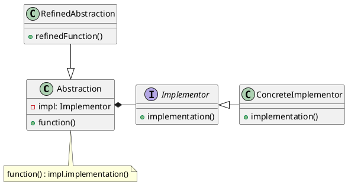

# 桥接模式(Bridge Pattern)


> 定义： 将抽象部分与实现部分分离，使他们可以独立的变化。

**类型：** 结构型模式

**UML**




**角色定义**

- **Abstraction(abstract class)-抽象类：** 定义抽象接口，持有/维持 implementor 的引用
- **RefinedAbstraction(normal class)-正常的类：** 拓展由Abstraction定义的接口
- **Implementor(interface)-执行者：** 定义执行者的接口
- **ConcreteImplementor(normal class)-具体类:** 实现Implementor接口


**Bridge设计模式可以解决哪些问题？**

- 抽象及其实现应该彼此独立地定义和扩展。
- 避免抽象及其实现之间的编译时绑定，以便可以在运行时选择实现。

使用子类时，不同的子类以不同的方式实现抽象类。但是实现在编译时绑定到抽象，并且不能在运行时更改。

## 桥接模式实例

**Implementor(Logger.java)**
```java
@FunctionalInterface
public interface Logger {

    /**
     * 打印日志
     * @param message message
     */
    void log(String message);

    /**
     * info级别日志
     * @return LOGGER
     */
    static Logger info(){
        return message -> System.out.println("info: " + message);
    }

    /**
     * warn级别日志
     * @return LOGGER
     */
    static Logger warning(){
        return message -> System.out.println("warning: " + message);
    }
}
```

**Abstraction(AbstractAccount.java)**
```java
public class AbstractAccount {
    /** 自定义日志 支持 info/warn */
    private Logger logger = Logger.info();

    /**
     * 设置打印的日志
     * @param logger Logger
     */
    public void setLogger(Logger logger) {
        this.logger = logger;
    }

    /**
     * 操作记录
     * @param message 信息
     * @param action 结果
     */
    protected void operate(String message, BooleanSupplier action) {
        boolean result = action.getAsBoolean();
        logger.log(message + " result " + result);
    }
}
```

**RefinedAbstraction(SimpleAccount.java)**
```java
public class SimpleAccount extends AbstractAccount {

    /**
     * 余额
     */
    private int balance;

    /**
     * 初始化账号余额
     *
     * @param balance balance
     */
    public SimpleAccount(int balance) {
        this.balance = balance;
    }

    /**
     * 判断是否快余额不足
     * 判断条件为小于50
     *
     * @return boolean
     */
    public boolean isBalanceLow() {
        return this.balance < 50;
    }

    /**
     * 取出余额
     *
     * @param amount 数量
     */
    public void withdraw(int amount) {
        operate("withdraw " + amount, () -> {
            if (this.balance >= amount) {
                this.balance -= amount;
                return true;
            }
            return false;
        });
    }

}
```

**Client**
```java
public class BridgeDemo {
    public static void main(String[] args) {
        // 1. 初始化账号
        SimpleAccount account = new SimpleAccount(100);

        // 2. 取出75
        account.withdraw(75);
        // info: withdraw 75 result true

        // 3. 判断余额是否已经到警戒值，切换日志级别
        if (account.isBalanceLow()){
            account.setLogger(Logger.warning());
        }

        // 4. 取出10
        account.withdraw(10);
        // warning: withdraw 10 result true

        // 5. 取出100
        account.withdraw(100);
        // warning: withdraw 100 result false
    }
}
```

