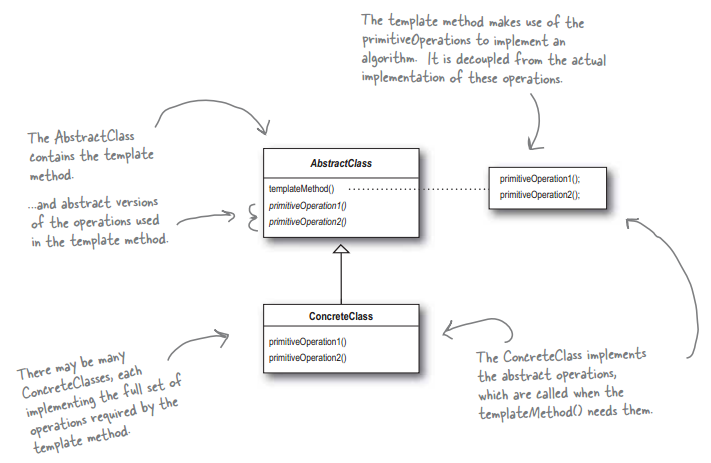

# 模板方法模式（Template Method）
> 定义一个操作中的算法的框架，而将一些步骤延迟到子类中。  
使得子类可以不改变一个算法的结构即可重新定义该算法的某些特定步骤  
> 简单来说就是：定义一个模板,将具体实现推迟到子类中进行重写实现。  




**简述：**
- 模板方法模式是基于`继承`的代码`复用`的基本技术,没有关联关系。
- 在模板方法模式的类结构图中，`只有继承关系`
- 代表这些具体逻辑步骤的方法称做`基本方法(primitive method)`
- 将这些基本方法汇总起来的方法叫做`模板方法(template method)`

## 模板方法实例

下面以煮咖啡味例子，演示模板方法模式以及钩子的用法。

**AbstractCoffeeMake**
```java
public abstract class AbstractCoffeeMake {

    /** ① 烧热水 公共方法，都会用到*/
    public void boilingWater(){
        System.out.println("Boiling water...");
    }

    /** ② 制作咖啡，将具体实现延迟到子类*/
    public abstract void cookeCoffee();

    /** ③ 加糖，将具体实现延迟到子类*/
    public abstract void addSugar();

    /** ④ 加牛奶，将具体实现延迟到子类*/
    public abstract void addMilk();

    /** 
     * 模板方法，决定算法骨架，相当于TemplateMethod()方法 
     * final 关键字表示不希望被子类继承修改
     */
    public final void make(){
        this.boilingWater();
        this.cookeCoffee();
        if (this.needSugar()){
            this.addSugar();
        }
        if (this.needMilk()){
            this.addMilk();
        }
    }

    /**
     * 钩子方法，子类决定是否加糖
     * @return boolean
     */
    protected boolean needSugar(){
        return true;
    }

    /**
     * 钩子方法，子类决定是否加牛奶
     * @return boolean
     */
    protected boolean needMilk(){
        return true;
    }

}
```

**LatteCoffeeMake**
```java
public class LatteCoffeeMake extends AbstractCoffeeMake{

    private boolean needSugar = true;

    private boolean needMilk = true;

    @Override
    public void cookeCoffee() {
        System.out.println("cooke a cup of Latte coffee...");
    }

    @Override
    public void addSugar() {
        System.out.println("add 0.5 cup of sugar to coffee...");
    }

    @Override
    public void addMilk() {
        System.out.println("add 200 ml milk to coffee...");
    }

    /**
     * 覆写钩子方法返回标记
     * @return this.needSugar
     */
    @Override
    protected boolean needSugar() {
        return this.needSugar;
    }

    /**
     * 覆写钩子方法返回标记
     * @return this.needMilk
     */
    @Override
    protected boolean needMilk() {
        return this.needMilk;
    }

    public void setNeedSugar(boolean needSugar) {
        this.needSugar = needSugar;
    }

    public void setNeedMilk(boolean needMilk) {
        this.needMilk = needMilk;
    }
}
```

**InstantCoffeeMake**
```java
public class InstantCoffeeMake extends AbstractCoffeeMake{

    private boolean needSugar = true;

    private boolean needMilk = true;

    @Override
    public void cookeCoffee() {
        System.out.println("cooke a cup of Instant coffee...");
    }

    @Override
    public void addSugar() {
        System.out.println("add a cup of sugar to coffee...");
    }

    @Override
    public void addMilk() {
        System.out.println("add 100 ml milk to coffee...");
    }

    /**
     * 覆写钩子方法返回标记
     * @return this.needSugar
     */
    @Override
    protected boolean needSugar() {
        return this.needSugar;
    }

    /**
     * 覆写钩子方法返回标记
     * @return this.needMilk
     */
    @Override
    protected boolean needMilk() {
        return this.needMilk;
    }

    public void setNeedSugar(boolean needSugar) {
        this.needSugar = needSugar;
    }

    public void setNeedMilk(boolean needMilk) {
        this.needMilk = needMilk;
    }
}
```

**测试类**
```java
    public static void main(String[] args) {
        final InstantCoffeeMake coffeeMake = new InstantCoffeeMake();
        coffeeMake.setNeedMilk(false);
        coffeeMake.make();
        // Boiling water...
        // cooke a cup of Instant coffee...
        // add a cup of sugar to coffee...

        final LatteCoffeeMake latteCoffeeMake = new LatteCoffeeMake();
        latteCoffeeMake.setNeedSugar(false);
        latteCoffeeMake.make();
        // Boiling water...
        // cooke a cup of Latte coffee...
        // add 200 ml milk to coffee...        
    }
```

## 模板方法的优缺点

### 优点
- 封装性，封装不变部分，扩展可变部分.
- 复用性，提取公共部分代码，去除重复代码.
- 行为由父类控制，子类实现细节，有助于算法的扩展

### 缺点
- 每个不同的实现都需要定义一个子类，这会导致类的个数的增加，系统不容易管理。

