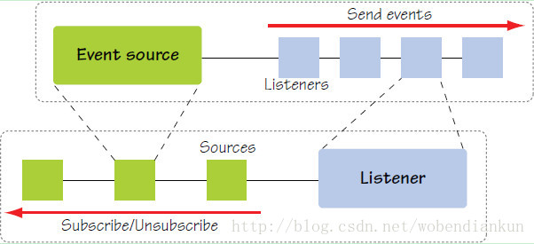

# 监听器模式

监听器模式其实是观察者模式中的一种，两者都有关于回调的设计。

与观察者模式不同的是，观察者模式中存在的角色为`观察者(Observer)`和`被观察者(Observable)`

而监听器模式中存在三种角色

- **事件源(EventSource)**
- **事件对象(EventObject)**
- **事件监听器(EventListener)**

简单的概述就是: 事件源经过事件的封装传给监听器，当事件源触发事件后，监听器接收到事件对象可以回调事件的方法

下面这张图可以很详细解释他们之间的关系




## 简单的实例

**UML**


#### 事件源

```java
public class DemoEventSource {

    /** 监听器列表 */
    public Vector<DemoEventListener> listeners = new Vector<>();

    /**
     * 注册监听器
     * @param listener EventListener
     */
    public void addListener(DemoEventListener listener) {
        listeners.add(listener);
    }

    /**
     * 撤销监听器
     * @param listener EventListener
     */
    public void removeListener(DemoEventListener listener) {
        listeners.remove(listener);
    }


    /**
     * 通知所有监听器,包裹事件源成为事件
     * @param eventObject EventObject
     */
    public void notifyListenerEvents(EventObject eventObject){
        listeners.forEach(listener ->{
            listener.handleEvent(eventObject);
        });
    }
}
```

#### 事件对象
```java
public class DemoEventObject extends EventObject {

    /**
     * Constructs a prototypical Event.
     *
     * @param source The object on which the Event initially occurred.
     * @throws IllegalArgumentException if source is null.
     */
    public DemoEventObject(Object source) {
        super(source);
    }


    /**
     * 事件的回调或者业务逻辑
     */
    public void say() {
        System.out.println("this is " + this + " to say");
    }
}
```

#### 事件监听器
```java
public interface DemoEventListener extends EventListener {

    /**
     * 处理事件
     * @param eventObject EventObject
     */
    void handleEvent(EventObject eventObject);
}

public class ConcreteEventListenerA implements DemoEventListener {

    @Override
    public void handleEvent(EventObject eventObject) {
        System.out.println("ConcreteEventListenerA accept eventObject , eventSource is : " + eventObject.getSource());
        if (eventObject instanceof DemoEventObject) {
            // 执行事件的回调函数/具体业务逻辑
            ((DemoEventObject) eventObject).say();
        }
    }
}

public class ConcreteEventListenerB implements DemoEventListener {

    @Override
    public void handleEvent(EventObject eventObject) {
        System.out.println("ConcreteEventListenerB accept eventObject , eventSource is : " + eventObject.getSource());

        if (eventObject instanceof DemoEventObject) {
            // 执行事件的回调函数/具体业务逻辑
            ((DemoEventObject) eventObject).say();
        }

    }
}
```

#### 客户端
```java
public class Client {
    public static void main(String[] args) {

        // 初始化监听器
        DemoEventListener demoEventListenerA = new ConcreteEventListenerA();
        DemoEventListener demoEventListenerB = new ConcreteEventListenerB();

        // 事件源A
        DemoEventSource demoEventSource1 = new DemoEventSource();
        demoEventSource1.addListener(demoEventListenerA);
        demoEventSource1.addListener(demoEventListenerB);
        demoEventSource1.notifyListenerEvents(new DemoEventObject(demoEventSource1));

        // 事件源B
        DemoEventSource demoEventSource2 = new DemoEventSource();
        demoEventSource2.addListener(demoEventListenerB);
        demoEventSource2.notifyListenerEvents(new DemoEventObject(demoEventSource2));
    }
}
```