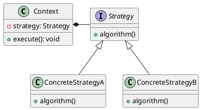
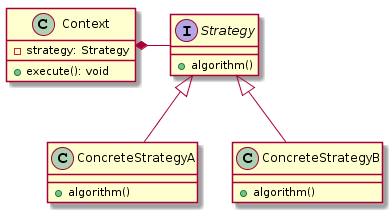

# 策略器模式(Strategy Pattern)


> 定义： 策略模式的用意是针对一组算法，将每一个算法封装到具有共同接口的独立的类中，从而使得它们可以在运行时相互替换。

**类型：** 行为模式

**UML**





**角色说明**

- **环境(Context):** 持有一个策略的引用
- **抽象策略(Strategy/Policy):** 抽象策略角色，通常为一个接口或者抽象类
- **具体策略(ConcreteStrategy):** 封装了相关的算法或者行为


策略模式是对算法的包装，是把使用算法的责任和算法本身分割开，委派给不同的对象管理。

策略模式通常把一个系列的算法包装到一系列的策略类里面，作为一个抽象策略类的子类。

用一句话来说，就是："准备一组算法，并将每一个算法封装起来，使得它们可以互换。

策略又称做政策（`Policy`）模式【GOF95】，如`log4j2`中的文件滚动就运用了该模式

## 策略模式实例

模拟商场平常时间的价格和打折时期的价格变化

**打折策略 Strategy**
```java
@FunctionalInterface
public interface Strategy {

    /**
     * 获取价格
     * @param rawPrice 价格
     * @return 价格
     */
    int getPrice(int rawPrice);

    /**
     * 常规价格
     * @return rawPrice
     */
    static Strategy normalStrategy(){
        return rawPrice -> rawPrice;
    }

    /**
     * 打折价格
     * @return rawPrice / 2
     */
    static Strategy discountStrategy(){
        return rawPrice -> rawPrice / 2;
    }
}
```

**消费者 Context**
```java
public class Context {
    private final List<Integer> drinks = new ArrayList<>();
    private Strategy strategy;

    /**
     * 初始化策略
     * @param strategy 策略
     */
    public Context(Strategy strategy) {
        this.strategy = strategy;
    }

    /**
     * 添加商品
     * @param price 价格
     * @param quantity 数量
     */
    public void add(int price, int quantity) {
        this.drinks.add(this.strategy.getPrice(price * quantity));
    }

    /**
     * 打印最终价格
     */
    public void print() {
        // 计算总价
        int sum = this.drinks.stream().mapToInt((v) -> v).sum();
        // 输出
        System.out.println("Total cost: " + sum);
        // 清空
        this.drinks.clear();
    }

    /**
     * 设置策略
     * @param strategy 策略
     */
    public void setStrategy(Strategy strategy) {
        this.strategy = strategy;
    }
}
```

**收银台 Client**
```java
public class Client {
    public static void main(String[] args) {
        final Strategy normalStrategy = Strategy.normalStrategy();
        final Strategy discountStrategy = Strategy.discountStrategy();

        Context customer1 = new Context(normalStrategy);

        //----常规价格------
        customer1.add(100, 1);


        //----开始打折------
        // 半价

        customer1.setStrategy(discountStrategy);
        customer1.add(100, 2);
        // 打印价格
        customer1.print();
        // Total cost: 200


        Context customer2 = new Context(discountStrategy);
        customer2.add(100, 1);
        customer2.add(100, 1);
        //----打折结束------


        customer2.setStrategy(normalStrategy);
        customer2.add(100, 1);
        // 打印价格
        customer2.print();
        // Total cost: 200
    }
}
```

## 策略模式优缺点

策略模式主要是组织和调度这些算法(`Strategy`)

策略模式可以描述为: 策略算法是相同行为的不同实现

**优点:**
-  策略模式提供了管理相关的算法族的办法。策略类的等级结构定义了一个算法或行为族。恰当使用继承可以把公共的代码移到父类里面，从而避免重复的代码。

- 使用策略模式可以避免使用多重条件(if-else)语句

- 策略模式使用组合而不是继承。体现了`Favor composite over inheritance`的观点

**缺点:**
- 客户端必须知道所有的策略类，并自行决定使用哪一个策略类。

- 策略模式造成很多的策略类。

**与桥接模式(Bridge)对比**

`Strategy`模式注重于算法的封装，而`Bridge`模式注重于分离抽象和实现，为一个抽象体系提供不同的实现