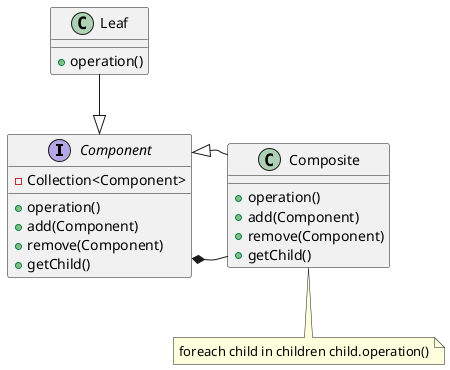
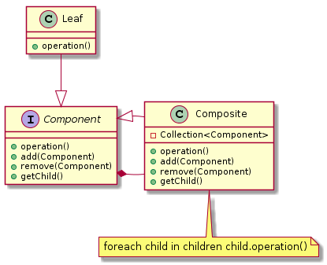

# 组合模式(Composite Pattern)

> 定义： 部分整体模式,创建了对象组的树形结构，使得用户对单个对象和组合对象的使用具有一致性

**首先整体的结构应该是一棵树，第二，所有的组件应该有一个共同的父类（有共同的本质)**

**类型：** 结构型模式

**UML**

**角色定义**

- **Component(abstract/interface)-抽象构建角色：** 
    - 声明组件`composite`的父类接口
    - 定义公共行为，如`operation()`
    - 管理所有的组件`components`
- **Leaf-叶节点角色：** 
    - 在组合中表示子节点对象，叶子节点不能有子节点。
- **Composite-叶子节点角色：** 
    - 定义有枝节点的行为，用来存储部件，实现在`Component`接口中的有关操作，如增加（`Add`）和删除（`Remove`）。

**Composite设计模式可以解决哪些问题？**

- 当应用程序具有分层结构并且需要跨结构的通用功能时。
- 当应用程序需要跨层次结构聚合数据时。
- 当应用程序要统一对待复合对象和单个对象时。

## 组合模式的优缺点

**优点：**
- 层次分明，表示对象的全部或部分层次，使得增加新构件也更容易。
- 一致地处理对象和对象容器，无需关系处理的单个对象，还是组合的对象容器。

**缺点：**
- 使设计变得更加抽象，对象的业务规则如果很复杂

## 参考
[设计模式--组合模式的思考](https://cloud.tencent.com/developer/article/1347596)

[Composite Design Pattern](https://howtodoinjava.com/design-patterns/structural/composite-design-pattern/)

