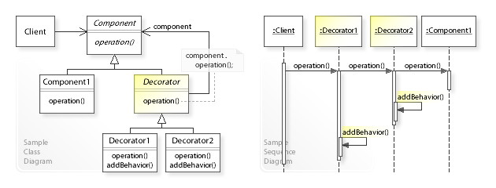
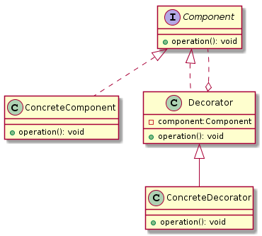
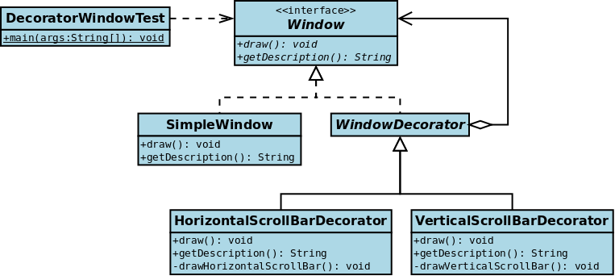

# 装饰器模式(Decorator Pattern)



> 定义： 在面向对象的编程中，装饰器模式是一种设计模式，又名包装(Wrapper)，它允许动态地将行为添加到单个对象，而不会影响来自同一类的其他对象的行为。  
Definition: In object-oriented programming, the decorator pattern is a design pattern that allows behavior to be added to an individual object, dynamically, without affecting the behavior of other objects from the same class.

****类型：**** 结构型

****类比：**** 装饰者模式在结构上几乎与责任链模式相同，不同之处在于，在一个责任链中，其中一个类正好处理请求，而对于装饰器，所有类都处理请求。

****UML****



#### Decorator设计模式可以解决哪些问题？

- 应在运行时动态地将责任添加到对象中（并从中删除）。
- 应提供用于扩展功能（继承）的子类化的灵活替代方案。

#### Decorator设计模式描述了什么解决方案？
定义那些Decorator对象
- `Component`通过将所有请求转发给它来透明地实现扩展（装饰）对象的接口
- 在转发请求之前/之后执行其他功能。

#### 在装饰器模式中的角色有：
- ****抽象构件(Component)角色：**** 给出一个抽象接口，已规范准备接收附加责任的对象。
- ****具体构件(ConcreteComponent)角色：**** 定义一个将要接收附加责任的类
- ****装饰(Decorator)角色：**** 持有一个构件(Component)对象的实例，并定义一个与抽象构件接口一致的接口。
- ****具体装饰(ConcreteDecorator)角色:**** 负责给构件对象“贴上”附加的责任

|Pattern|Intent|
|:----|----:|
|Adapter or Wrapper| Converts one interface to another so that it matches what the client is expecting|
|Decorator|Dynamically adds responsibility to the interface by wrapping the original code|
|Delegation(委派模式)|Support "composition over inheritance"|
|Facade|Provides a simplified interface|


## 装饰器实例



****抽象构件(Component)角色：****
```java
public interface Window {
    /** Draws the window */
    void draw();

    /**
     * Returns a description of window
     * @return Description
     */
    String getDescription();
}
```

****具体构件(ConcreteComponent)角色：****
```java
public class SimpleWindow implements Window{
    @Override
    public void draw() {
        System.out.println("Draw simple window...");
    }

    @Override
    public String getDescription() {
        return "Simple Window";
    }
}
```

****装饰(Decorator)角色：****
```java
public abstract class WindowDecorator implements Window{

    /** 被装饰的类 */
    protected Window windowToBeDecorated;

    public WindowDecorator(Window windowToBeDecorated) {
        this.windowToBeDecorated = windowToBeDecorated;
    }

    @Override
    public void draw() {
        // 被装饰对象执行方法
        windowToBeDecorated.draw();
    }

    @Override
    public String getDescription() {
        // 被装饰对象执行方法
        return windowToBeDecorated.getDescription();
    }
}
```

****具体装饰(ConcreteDecorator)角色:****
```java
public class HorizontalScrollBarDecorator extends WindowDecorator{

    public HorizontalScrollBarDecorator(Window windowToBeDecorated) {
        super(windowToBeDecorated);
    }

    @Override
    public void draw() {
        super.draw();
        this.drawHorizontalScrollBar();
    }

    /**
     * 绘制水平滚动条
     */
    private void drawHorizontalScrollBar() {
        // Draw the horizontal scrollbar
        System.out.println("Draw the horizontal scrollbar...");
    }

    @Override
    public String getDescription() {
        return super.getDescription() + ", including horizontal scrollbars";
    }
}

public class VerticalScrollBarDecorator extends WindowDecorator {

    public VerticalScrollBarDecorator(Window windowToBeDecorated) {
        super(windowToBeDecorated);
    }

    @Override
    public void draw() {
        super.draw();
        this.drawVerticalScrollBar();
    }

    /**
     * 绘制垂直滚动条
     */
    private void drawVerticalScrollBar(){
        // Draw the vertical scrollbar
        System.out.println("Draw the vertical scrollbar...");
    }

    @Override
    public String getDescription() {
        return super.getDescription() + ", including vertical scrollbars";
    }
}
```

****客户端：****
```java
public class DecoratedWindowTest {
    public static void main(String[] args) {
        // 装饰器动态追加功能
        // 1. 简单窗口
        final Window window = new SimpleWindow();

        // 2. 向简单窗口追加垂直滚动条
        final VerticalScrollBarDecorator verticalScrollBarDecorator = new VerticalScrollBarDecorator(window);

        // 3. 向垂直滚动条窗口添加水平滚动条
        final HorizontalScrollBarDecorator horizontalScrollBarDecorator = new HorizontalScrollBarDecorator(verticalScrollBarDecorator);

        // 4. 绘画最终窗口
        horizontalScrollBarDecorator.draw();
        
        // 5. 打印窗口描述
        System.out.println(horizontalScrollBarDecorator.getDescription());
        //  Draw simple window...
        //  Draw the vertical scrollbar...
        //  Draw the horizontal scrollbar...
        //  Simple Window, including vertical scrollbars, including horizontal scrollbars
    }
}
```

## 装饰器模式的优缺点
****优点****

- 装饰器模式与继承关系的目的都是要扩展对象的功能，但是装饰器模式可以提供比继承更多的灵活性。装饰器模式允许系统动态决定贴上一个需要的装饰，或者除掉一个不需要的装饰。继承关系是不同，继承关系是静态的，它在系统运行前就决定了
- 通过使用不同的具体装饰器以及这些装饰类的排列组合，设计师可以创造出很多不同的行为组合

****缺点****

由于使用装饰器模式，可以比使用继承关系需要较少数目的类。使用较少的类，当然使设计比较易于进行。但是另一方面，由于使用装饰器模式会产生比使用继承关系更多的对象，更多的对象会使得查错变得困难，特别是这些对象看上去都很像。

## 装饰器模式和适配器模式的区别
其实适配器模式也是一种包装（`Wrapper`）模式，它们看似都是起到包装一个类或对象的作用，但是它们使用的目的非常不一样：
- 适配器模式的意义是要将一个接口转变成另外一个接口，它的目的是通过改变接口来达到重复使用的目的
- 装饰器模式不要改变被装饰对象的接口，而是恰恰要保持原有的接口，但是增强原有接口的功能，或者改变元有对象的处理方法而提升性能