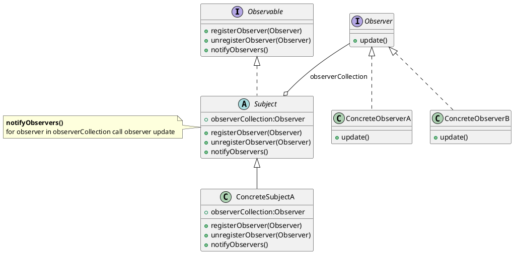

# 观察者模式(Observer)

>wiki: The observer pattern is a software design pattern in which an object, called the subject, maintains a list of its dependents, called observers, and notifies them automatically of any state changes, usually by calling one of their methods.

> 主要用于“事件驱动”实现分布式事物处理(Event Handling)。  
> 同义： 发布-订阅模式（pub-sub）、模型-视图模式（Model-View）、源-收听者(Listener)模式或从属者模式

> 类型：行为型模式


当对象间存在一对多关系时，则使用观察者模式(Observer Pattern)  
比如，当一个对象被修改时，则会自动通知它的依赖对象,通常是通过调用他们的一个方法  
观察者设计模式定义了对象间的一种一对多的组合关系，以便一个对象的状态发生变化时，所有依赖于它的对象都得到通知并自动刷新。


观察者模式解决了以下问题：

- A one-to-many dependency between objects should be defined without making the objects tightly coupled.
- It should be ensured that when one object changes state an open-ended number of dependent objects are updated automatically.
- It should be possible that one object can notify an open-ended number of other objects.

> UML：



主要的四种角色：抽象主题、具体主题、抽象观察者、具体观察者

- **抽象主题--被观察者(Subject)**
- **具体主题(ConcreteSubject)**
- **抽象观察者(Observer)**
- **具体观察者(ConcreteObserver)**

## 观察者模式实例

**观察者接口**

```java
public interface Observer {
    /**
     * 定义观察者接口
     * @param observable 被观察对象为Subject的子类
     * @param arg 传参
     */
    void update(Subject observable,Object arg);
}
```
**具体观察者**

```java
public class ConcreteObserverA implements Observer{
    @Override
    public void update(Subject observable,Object arg) {
        System.out.println("ConcreteObserverA accept and update...");
        System.out.println("Object : "+ observable);
        System.out.println("args : "+ arg);
    }
}

public class ConcreteObserverB implements Observer{
    @Override
    public void update(Subject observable,Object arg) {
        System.out.println("ConcreteObserverB accept and update...");
        System.out.println("Object : "+ observable);
        System.out.println("args : "+ arg);
    }
}
```

**可被观察接口**

```java
public interface Observable {
    /**
     * 注册观察者
     * @param observer observer
     */
    void registerObserver(Observer observer);

    /**
     * 注销观察者
     * @param observer observer
     */
    void unregisterObserver (Observer observer);

    /**
     * 通知观察者
     */
    void notifyObservers();
}
```

**被观察者抽象类**

```java
public abstract class Subject implements Observable {
    /** 观察者列表，考虑线程安全问题，替换为其他 */
    private Vector<Observer> observers = new Vector<>();

    @Override
    public void registerObserver(Observer observer) {
        observers.add(observer);
    }

    @Override
    public void unregisterObserver(Observer observer) {
        observers.remove(observer);
    }

    @Override
    public void notifyObservers() {
        for (Observer observer : observers) {
            // 通知观察者们
            observer.update(this,null);
        }
    }
}
```

**具体被观察者**

```java
public class ConcreteSubjectA extends Subject{

    private String data;

    public String getData() {
        return data;
    }

    public void setData(String data) {
        this.data = data;
        // 通知观察者，数据发生改变
        notifyObservers();
    }
}
```

**场景类**

```java
public class Client {
    public static void main(String[] args) {
        Observer observerA = new ConcreteObserverA();
        Observer observerB = new ConcreteObserverB();

        ConcreteSubjectA subject = new ConcreteSubjectA();
        subject.registerObserver(observerA);
        subject.registerObserver(observerB);
        subject.setData("ok");

        subject.unregisterObserver(observerB);
        subject.setData("test");
    }
}
```

## 使用JDK提供的API

**通过实现java.util.Observer接口，生成观察者**

```java
public class ConcreteObserver implements Observer {
    @Override
    public void update(Observable o, Object arg) {
        System.out.println("ConcreteObserver accept...");
        System.out.println("Object : "+ o);
        System.out.println("Observers count: "+ o.countObservers());
    }
}
```

**通过继承java.util.Observable类，实现被观察者**

```java
public class ConcreteObserved extends Observable {

    private String data;

    public void setData(String data) {
        this.data = data;
        // 设置发生了变化,将 Change 设置为true
        this.setChanged();
        // 通知观察者们，并将 Change 设置为false
        this.notifyObservers();
    }
}
```

**场景类**

```java
public class Client {
    public static void main(String[] args) {
        ConcreteObserver observer = new ConcreteObserver();

        ConcreteObserved observed = new ConcreteObserved();
        observed.addObserver(observer);
        observed.setData("ok");
        // ConcreteObserver accept...
        // Object : com.xinchen.pattern.Observe.JDK.ConcreteObserved@60e53b93
        // Observers count: 1
    }
}
```

## 观察者模式优点和缺点

**优点:**
- 观察者和被观察者之间抽象耦合
- 观察者模式容易扩展，被观察者只持有观察者集合，并不需要知道具体观察者内部的实现

**缺点：**
- 如果观察者太多，被观察者通知观察者消耗的时间很多，影响系统的性能
- 当观察者集合中的某一观察者错误时就会导致系统卡壳，因此一般会采用异步方式


**使用：**
- MVC:观察目标就是 Model ，观察者就是 View， Controller 为两者之间的中介
- 发布-订阅模式（pub-sub）
- `Tomcat`控制组件生命周期的`Lifecycle`,还有对`Servlet`实例的创建、`Session`的管理、`Container`等
- Spring中ApplicationListener

