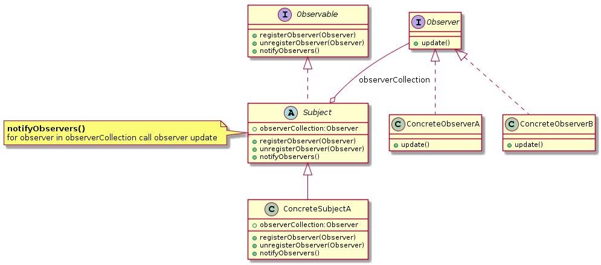

# 观察者模式(Observer)

>wiki: The observer pattern is a software design pattern in which an object, called the subject, maintains a list of its dependents, called observers, and notifies them automatically of any state changes, usually by calling one of their methods.

> 主要用于“事件驱动”实现分布式事物处理(Event Handling)。  
> 同义： 发布-订阅模式（pub-sub）、模型-视图模式（Model-View）、源-收听者(Listener)模式或从属者模式

> 类型：行为型模式

当对象间存在一对多关系时，则使用观察者模式(Observer Pattern)  
比如，当一个对象被修改时，则会自动通知它的依赖对象,通常是通过调用他们的一个方法  
观察者设计模式定义了对象间的一种一对多的组合关系，以便一个对象的状态发生变化时，所有依赖于它的对象都得到通知并自动刷新。

观察者模式解决了以下问题：

- A one-to-many dependency between objects should be defined without making the objects tightly coupled.
- It should be ensured that when one object changes state an open-ended number of dependent objects are updated automatically.
- It should be possible that one object can notify an open-ended number of other objects.

> UML：

主要的四种角色：抽象主题、具体主题、抽象观察者、具体观察者

- **抽象主题(Subject)**
- **具体主题(ConcreteSubject)**
- **抽象观察者(Observer)**
- **具体观察者(ConcreteObserver)**

## 观察者模式实例