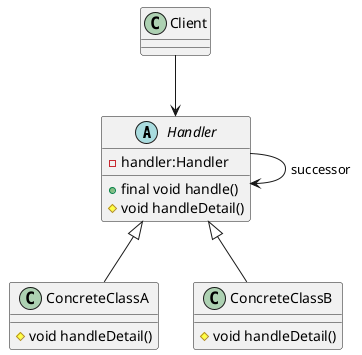
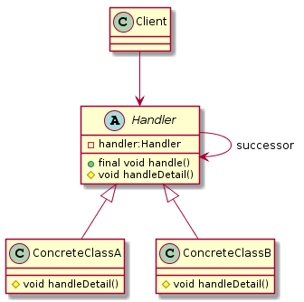
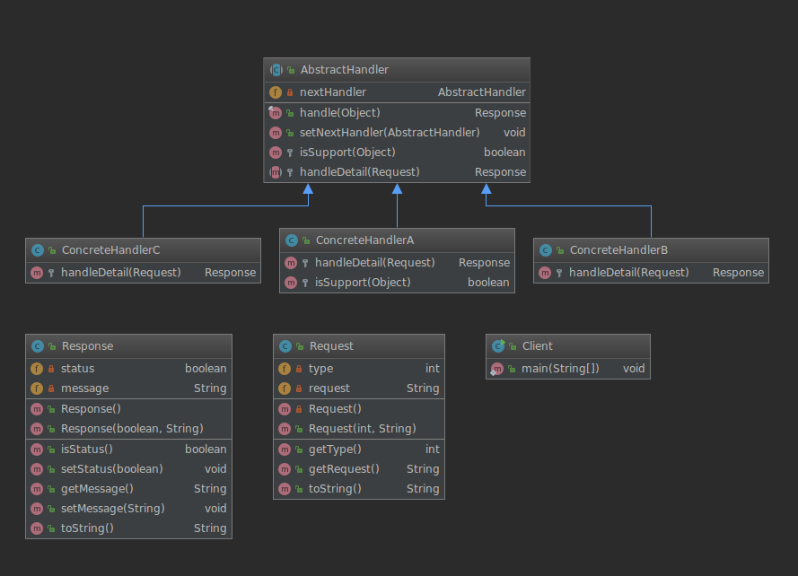

# 责任链模式（Chain Of Responsibiltiy）

> 定义: 使多个对象都有机会处理请求，从而避免了请求的发送者和接收者之间的耦合关系。将这些对象连成一条链(不一定是直线,也可以是环或者其他的)，并沿着这条链传递该请求，直到有对象处理它为止。

> 责任链模式有点类似于递归,在结构上与装饰器模式几乎相同，不同之处在于对于装饰器，所有类都处理请求，而对于责任链，链中的一个类恰好处理请求。

> 类型:行为类模式

> wiki:https://en.wikipedia.org/wiki/Chain-of-responsibility_pattern


> UML类图






## 责任链模式实例

**整体结构**



### 实体类

**Request(请求实体类)**
```java
public class Request{
    /** 请求类型 */
    private int type;
    /** 请求信息 */
    private String request;

    private Request() {}

    public Request(int type, String request) {
        this.type = type;
        this.request = request;
    }

    public int getType() {
        return type;
    }

    public String getRequest() {
        return request;
    }

    @Override
    public String toString() {
        return "Request{" +
                "type=" + type +
                ", request='" + request + '\'' +
                '}';
    }
}
```


**Response(响应实体类)**
```java
public class Response {
    /** 请求状态 成功:true 失败:false */
    private boolean status = false;
    /** 返回消息 */
    private String message = "请求失败";


    public Response(){}


    public Response(boolean status, String message) {
        this.status = status;
        this.message = message;
    }

    public boolean isStatus() {
        return status;
    }

    public void setStatus(boolean status) {
        this.status = status;
    }

    public String getMessage() {
        return message;
    }

    public void setMessage(String message) {
        this.message = message;
    }

    @Override
    public String toString() {
        return "Response{" +
                "status=" + status +
                ", message='" + message + '\'' +
                '}';
    }
}
```
### 抽象处理类

**AbstractHandler**
```java
public abstract class AbstractHandler {

    /** 下一个处理方法 */
    private AbstractHandler nextHandler;

    /**
     * 定义算法骨架
     * @param o 请求对象 Request
     * @return 响应对象 Response
     */
    public final Response handle(Object o){
        // 判断当前处理类是否支持该请求的处理
        if (this.isSupport(o)){
            return this.handleDetail((Request) o);
        } else {
            // 判断是否还有下一处理链,没有则返回默认Response
            return null != this.nextHandler ? this.nextHandler.handle(o) : new Response();
        }
    }

    /**
     * 设置下一个处理类
     * @param nextHandler nextHandler
     */
    public void setNextHandler(AbstractHandler nextHandler) {
        this.nextHandler = nextHandler;
    }

    /** 钩子,判断当前处理类是否支持处理 */
    protected boolean isSupport(Object object){
        return (object instanceof Request);
    }

    /** 处理细节,延到实现类处理 */
    protected abstract Response handleDetail(Request request);

}
```

### 具体实现类
**ConcreteHandlerA**
```java
public class ConcreteHandlerA extends AbstractHandler{

    /**
     * 处理细节
     * @param request Request 请求对象
     * @return Response 响应对象
     */
    @Override
    protected Response handleDetail(Request request) {
        System.out.println(">>> ConcreteHandlerA Accept Request : "+ request.toString());
        return new Response(true,"return from ConcreteHandlerA...");
    }

    /**
     * 覆盖父类判断是否支持处理方法
     * @param object 请求对象
     * @return boolean
     */
    @Override
    protected boolean isSupport(Object object) {
        // 只处理 request 类型type为 1 的
        return super.isSupport(object) && 1 ==((Request) object).getType();
    }
}
```

**ConcreteHandlerB**

```java
public class ConcreteHandlerB extends AbstractHandler{
    /**
     * 处理细节
     * @param request Request 请求对象
     * @return Response 响应对象
     */
    @Override
    protected Response handleDetail(Request request) {
        System.out.println(">>> ConcreteHandlerB Accept Request : "+ request.toString());
        return new Response(true, "return from ConcreteHandlerB...");
    }
}
```
**ConcreteHandlerC**
```java
public class ConcreteHandlerC extends AbstractHandler{
    /**
     * 处理细节
     * @param request Request 请求对象
     * @return Response 响应对象
     */
    @Override
    protected Response handleDetail(Request request) {
        System.out.println(">>> ConcreteHandlerC Accept Request : "+ request.toString());
        return new Response(true, "return from ConcreteHandlerC...");
    }
}
```

### 客户端(执行者)

**Client**
```java
public class Client {
    public static void main(String[] args) {

        // 声明处理节点
        AbstractHandler handlerA = new ConcreteHandlerA();
        AbstractHandler handlerB = new ConcreteHandlerB();
        AbstractHandler handlerC = new ConcreteHandlerC();

        // 设置处理顺序 A->B->C
        handlerA.setNextHandler(handlerB);
        handlerB.setNextHandler(handlerC);

        // 发起请求
        Request request = new Request(3, "hello");
        final Response handle = handlerA.handle(request);
        System.out.println(">>> Response: "+handle);
        // >>> ConcreteHandlerB Accept Request : Request{type=3, request='hello'}
        // >>> Response: Response{status=true, message='return from ConcreteHandlerB...'}


        final Response handle1 = handlerA.handle(new Object());
        System.out.println(">>> Response: "+handle1);
        // >>> Response: Response{status=false, message='请求失败'}

    }
}
```
