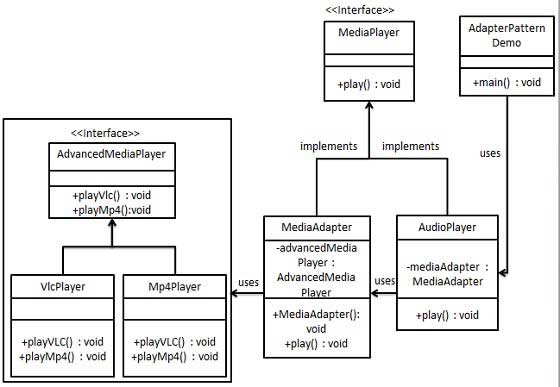

# 适配器模式(Adapter Pattern)


> 定义: 适配器允许两个不兼容的接口一起工作.  
> Definition: An adapter allows two incompatible interfaces to work together. 

> 类型: 结构型

#### 用法:

****When?****: An adapter can be used when the wrapper must respect(遵循) a particular(特定) interface and must support polymorphic(多态) behavior. 

- 当包装器(wrapper)必须遵循特定接口并且必须支持多态行为时，可以使用适配器模式。
- 装饰器模式可以在运行时添加或更改接口的行为
- 在需要更简单或更简单的基础对象接口时使用外观模式。


|Pattern|Intent|
|:----|----:|
|Adapter or Wrapper| Converts one interface to another so that it matches what the client is expecting|
|Decorator|Dynamically adds responsibility to the interface by wrapping the original code|
|Delegation(委派模式)|Support "composition over inheritance"|
|Facade|Provides a simplified interface|


### 对象适配器模式(Object adapter pattern)

在此适配器模式中，适配器包含它包装的类的实例。在这种情况下，适配器调用包装对象的实例。

****UML****


### 类适配器模式(Class adapter pattern)

此适配器模式使用多个多态接口实现或继承预期的接口和预先存在的接口。通常将期望的接口创建为纯接口类，尤其是在不支持类的多重继承的Java（JDK 1.8之前）等语言中。

****UML****


## 适配器模式实例

***UML***



****适配器接口****
```java
// 媒体播放器可能包含多种类型(本系统中的)
public interface MediaPlayer {
    void play(String audioType, String fileName);
}

// 高级媒体播放器可能包含多种类型(将要调用的外系统中的)
public interface AdvancedMediaPlayer {
    void playVlc(String fileName);

    void playMp4(String fileName);
}
```

****AdvancedMediaPlayer支持的具体类型****
```java
public class VlcPlayer implements AdvancedMediaPlayer{
    @Override
    public void playVlc(String fileName) {
        System.out.println("Playing vlc file. file name: "+ fileName);
    }

    @Override
    public void playMp4(String fileName) {
        // do nothing...
    }
}

public class Mp4Player implements AdvancedMediaPlayer{
    @Override
    public void playVlc(String fileName) {
        // do nothing...
    }

    @Override
    public void playMp4(String fileName) {
        System.out.println("Playing mp4 file. file name: "+ fileName);
    }
}
```

****润滑油(适配器)****

```java
public class MediaAdapter implements MediaPlayer {

    private AdvancedMediaPlayer advancedMediaPlayer;

    public MediaAdapter(String audioType) {
        if ("vlc".equalsIgnoreCase(audioType)) {
            advancedMediaPlayer = new VlcPlayer();
        } else if ("mp4".equalsIgnoreCase(audioType)) {
            advancedMediaPlayer = new Mp4Player();
        }
    }


    @Override
    public void play(String audioType, String fileName) {
        // 适配器支持两种 vlc 和 mp4格式
        if(audioType.equalsIgnoreCase("vlc")){
            advancedMediaPlayer.playVlc(fileName);
        }
        else if(audioType.equalsIgnoreCase("mp4")){
            advancedMediaPlayer.playMp4(fileName);
        }
    }
}
```

****具体调用类(自生产品功能类)****
```java
public class AudioPlayer implements MediaPlayer {

    private MediaAdapter mediaAdapter;

    @Override
    public void play(String audioType, String fileName) {

        // 内置类型
        if ("mp3".equalsIgnoreCase(audioType)){
            System.out.println("Playing mp3 file. file name: "+ fileName);
        }

        // 适配器提供的支持的其他类型
        else if ("vlc".equalsIgnoreCase(audioType)|| "mp4".equalsIgnoreCase(audioType)){
            mediaAdapter = new MediaAdapter(audioType);
            mediaAdapter.play(audioType,fileName);
        } else {
            System.out.println("Invalid media. " + audioType + " format not supported");
        }
    }
}
```

****使用场景****
```java
public class AdapterPatternDemo {
    public static void main(String[] args) {
        AudioPlayer audioPlayer = new AudioPlayer();
        audioPlayer.play("mp3","hello.mp3");
        audioPlayer.play("mp4","hello.mp4");
        audioPlayer.play("vlc","hello.vlc");
        audioPlayer.play("avi","hello.avi");
    }
}
```

## Adapter Pattern的优缺点

****优点:****

- 可以让任何两个没有关联的类一起运行
- 提高了类的复用
- 增加了类的透明度


****缺点:****
- 过度使用会造成系统混乱零散
- 由于 JAVA 至多继承一个类，所以至多只能适配一个适配者类，而且目标类必须是抽象类
