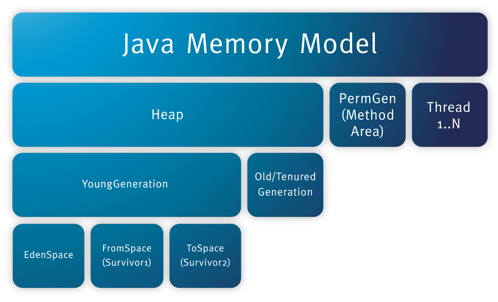

# JMM内存模型和JVM内存结构


## JAVA内存模型(Java Memory Model)

Java内存模型，一般指的是JDK 5 开始使用的新的内存模型，主要由[JSR-133: JavaTM Memory Model and Thread Specification](http://203.187.160.132:9011/www.cs.umd.edu/c3pr90ntc0td/~pugh/java/memoryModel/jsr133.pdf) 描述。

`JMM`就是一种符合内存模型规范的，屏蔽了各种硬件和操作系统的访问差异的，保证了`Java`程序在各种平台下对内存的访问都能保证效果一致的机制及规范。

内存模型可以理解为在特定的操作协议下，对特定的内存或者高速缓存进行读写访问的过程抽象，不同架构下的物理机拥有不一样的内存模型，Java虚拟机也有自己的内存模型，即Java内存模型（Java Memory Model, JMM）。在C/C++语言中直接使用物理硬件和操作系统内存模型，导致不同平台下并发访问出错。而JMM的出现，能够屏蔽掉各种硬件和操作系统的内存访问差异，实现平台一致性，是的Java程序能够“一次编写，到处运行”。


**JMM主要解决的问题： 解决由于多线程通过共享内存进行通信时，存在的本地内存数据不一致、编译器会对代码指令重排序、处理器会对代码乱序执行等带来的问题**

- 缓存一致性问题其实就是**可见性**问题。
- 处理器优化是可以导致**原子性**问题
- 指令重排即会导致**有序性**问题

**内存模型解决并发问题主要采用两种方式：限制处理器优化和使用内存屏障**


**参考**: 
- [深入理解JVM-内存模型（jmm）和GC](https://www.jianshu.com/p/76959115d486)
- [什么是Java内存模型](https://www.jianshu.com/p/bf158fbb2432)
- [来，了解一下Java内存模型(JMM)](https://www.cnblogs.com/gooder2-android/p/9509479.html?utm_source=oschina-app)

## JVM内存结构

传送门：[JAVA 虚拟机规范](https://docs.oracle.com/javase/specs/jvms/se8/html/jvms-2.html#jvms-2.5)

HotSpot 白皮书： [Memory Management in the Java HotSpot Virtual Machine](https://www.oracle.com/technetwork/java/javase/memorymanagement-whitepaper-150215.pdf) 它描述了垃圾回收(GC)触发的内存自动管理

其实 Java 虚拟机的内存结构并不是官方的说法，在《Java 虚拟机规范》中用的是「运行时数据区(Run-Time Data Areas)」这个术语


下图能很清晰的说明JVM内存结构布局：



JVM内存结构主要有三大块：

- **堆内存(Heap)**
- **方法区/永久代(Method Area/PermGen) 或者别名Non-Heap(非堆)**
- **栈(Thraed...)**

在《深入理解Java虚拟机（第二版）》中的描述是下面这个样子的：


按照《JAVA 虚拟机规范》的中所述，可以分为公有和私有两部分

- **公有部分:** 堆[Heap]、方法区[Method Area]、常量池[Constant Pool]

- **私有部分：** PC寄存器、VM虚拟机栈、本地方法栈


### 各个区域的内存大小

通过一张图了解如何通过参数来控制各个区域的内存大小


参数说明：
```bash
-Xms:设置堆的最小空间大小。

-Xmx:设置堆的最大空间大小。

-XX:NewSize设置新生代最小空间大小。

-XX:MaxNewSize设置新生代最大空间大小。

-XX:PermSize设置永久代最小空间大小。

-XX:MaxPermSize设置永久代最大空间大小。

-Xss:设置每个线程的堆栈大小。
```
没有直接设置老年代的参数，但是可以设置堆空间大小和新生代空间大小两个参数来间接控制。

**老年代空间大小=堆空间大小-年轻代大空间大小**

---

### JAVA堆(Heap)

Java堆是被所有线程共享的一块内存区域,在虚拟机启动时创建.

这块区域专门用于 Java 实例对象和数组的内存分配，**几乎所有实例对象都在会这里进行内存的分配**

之所以说几乎是因为有特殊情况，有些时候小对象会直接在栈上进行分配，这种现象我们称之为「栈上分配」

#### Java堆的内存划分

Java堆是垃圾收集器管理的主要区域，因此很多时候也被称做“GC堆”。

如果从内存回收的角度看，由于现在收集器基本都是采用的`分代收集算法`，所以Java堆中还可以细分

主要被划分为： 新生代「`Young Generation`」和老年代「`Old Generation`」

新生代「`Young Generation`」又可分为：`Eden`、`From Survivor 0`、`To Survivor 1`

根据《JAVA 虚拟机规范》的规定，Java堆可以处于物理上不连续的内存空间中，只要逻辑上是连续的即可，就像我们的磁盘空间一样。在实现时，既可以实现成固定大小的，也可以是可扩展的，不过当前主流的虚拟机都是按照可扩展来实现的（通过`-Xmx`和`-Xms`控制）。

堆可以具有固定大小，或者可以根据计算的需要进行扩展，并且如果不需要更大的堆，则可以收缩。

`如果在堆中没有内存完成实例分配，并且堆也无法再扩展时，将会抛出OutOfMemoryError异常。`
#### 不同区域的生命周期

- 新建(New)或者短期对象会存放在`Eden`区域
- 幸存或者中期的对象会从Eden拷贝到`Survivor`区域
- 始终存在的或者长期存在的对象将会从`Survivor`拷贝到`Old Generation`

当有对象需要分配时，一个对象永远优先被分配在年轻代的 `Eden` 区，等到 `Eden` 区域内存不够时，`Java 虚拟机`会启动垃圾回收。此时 `Eden` 区中没有被引用的对象的内存就会被回收，而一些存活时间较长的对象则会进入到老年代。

在 JVM 中有一个名为 `-XX:MaxTenuringThreshold` 的参数(默认为7)专门用来设置晋升到老年代所需要经历的 GC 次数，即在年轻代的对象经过了指定次数的 GC 后，将在下次 GC 时进入老年代

#### 为什么 Java 堆要进行这样一个区域划分呢

虚拟机中的对象必然有存活时间长的对象，也有存活时间短的对象，这是一个普遍存在的正态分布规律。如果我们将其混在一起，那么因为存活时间短的对象有很多，那么势必导致较为频繁的垃圾回收。而垃圾回收时不得不对所有内存都进行扫描，但其实有一部分对象，它们存活时间很长，对他们进行扫描完全是浪费时间。因此为了`提高垃圾回收效率`，分区就理所当然了

虚拟机`Heap Space`的默认配置为： `Eden：from ：to = 8:1:1 `

其实这是 IBM 公司根据大量统计得出的结果。根据 IBM 公司对对象存活时间的统计，他们发现 80% 的对象存活时间都很短。于是他们将 Eden 区设置为年轻代的 80%，这样可以减少内存空间的浪费，提高内存空间利用率


--- 

### 方法区(Method Area)

方法区（Method Area）与Java堆一样，是各个线程共享的内存区域,在虚拟机启动时创建。

它用于存储已被虚拟机加载的类结构，如：运行时常量池、静态变量、字段、和方法数据，即时编译器编译后的代码等数据，以及方法和构造函数的代码

Java虚拟机规范对这个区域的限制非常宽松，除了和Java堆一样不需要连续的内存和可以选择固定大小或者可扩展外，还可以选择不实现垃圾收集。相对而言，垃圾收集行为在这个区域是比较少出现的，但并非数据进入了方法区就如永久代的名字一样“永久”存在了。这个区域的内存回收目标主要是针对常量池的回收和对类型的卸载，一般来说这个区域的回收“成绩”比较难以令人满意，尤其是类型的卸载，条件相当苛刻，但是这部分区域的回收确实是有必要的。

`根据《Java虚拟机规范的规定》，当方法区无法满足内存分配需求时，将抛出OutOfMemoryError异常。 `

#### 方法区在不同版本的虚拟机有不同的表现形式

例如在 `1.7` 版本的 `HotSpot 虚拟机`中，方法区被称为`永久代（Permanent Space）`，而在 `JDK 1.8` 中则被称之为 `MetaSpace`

#### 拓展点

可以看到常量池其实是存放在方法区中的，但《Java 虚拟机规范》将常量池和方法区放在同一个等级上

虽然《Java虚拟机规范》把方法区描述为堆的一个逻辑部分，但是它却有一个别名叫做Non-Heap（非堆），目的应该是与Java堆区分开来。

对于习惯在HotSpot虚拟机上开发和部署程序的开发者来说，很多人愿意把方法区称为“永久代”（Permanent Generation），本质上两者并不等价，仅仅是因为HotSpot虚拟机的设计团队选择把GC分代收集扩展至方法区，或者说使用永久代来实现方法区而已。

---

### 程序计数器(Program Counter Register)

每个Java虚拟机线程都有自己`私有独立`的 pc（程序计数器）寄存器。

它的作用可以看做是当前线程所执行的字节码的行号指示器。

在任何时候，`每个Java虚拟机线程都在执行单个方法的代码`，即该线程的当前方法。如果不是该方法 native，则pc寄存器包含当前正在执行的Java虚拟机指令的地址。如果线程当前正在执行`native`方法，则Java虚拟机pc 寄存器的值为`undefined`。

`此内存区域是唯一一个在Java虚拟机规范中没有规定任何OutOfMemoryError情况的区域`

---

### JVM栈(Java Virtual Machine Stacks)

与程序计数器一样，Java虚拟机栈（`Java Virtual Machine Stack`）也是线程私有的，它的生命周期与线程相同，与线程同时创建。

`JVM Stack`存储帧(`Stack Frame`) [A Java Virtual Machine stack stores frames]


`JVM Stack`类似于传统语言的`Stack`，例如C语言：它保存局部变量和部分结果，并在方法调用和返回中起作用。由于除了推送和弹出帧(`Frames`)之外，永远不会直接操作Java虚拟机堆栈（Java Virtual Machine Stack），因此`帧(Frames)`可以是`堆(heap)`分配的。Java虚拟机堆栈的内存不需要是连续的。


`虚拟机栈(JVM Stacks)`描述的是Java方法执行的内存模型：每个方法被执行的时候都会同时创建一个`栈帧（Stack Frame）`用于存储局部变量表、操作数栈、动态链接、方法出口以及一些过程结果等信息。`每一个方法被调用直至执行完成的过程，就对应着一个栈帧在虚拟机栈中从入栈到出栈的过程。`

局部变量表存放了编译期可知的各种基本数据类型`（boolean、byte、char、short、int、float、long、double）`、对象引用（`reference类型`，它不等同于对象本身，根据不同的虚拟机实现，它可能是一个指向对象起始地址的引用指针，也可能指向一个代表对象的句柄或者其他与此对象相关的位置）和`returnAddress类型`（指向了一条字节码指令的地址）。

其中64位长度的long和double类型的数据会占用2个局部变量空间（Slot），其余的数据类型只占用1个。局部变量表所需的内存空间在编译期间完成分配，当进入一个方法时，这个方法需要在帧中分配多大的局部变量空间是完全确定的，在方法运行期间不会改变局部变量表的大小。

在Java虚拟机规范中，对这个区域规定了两种异常状况：如果线程请求的栈深度大于虚拟机所允许的深度，将抛出`StackOverflowError`异常；如果虚拟机栈可以动态扩展（当前大部分的Java虚拟机都可动态扩展，只不过Java虚拟机规范中也允许固定长度的虚拟机栈），当扩展时无法申请到足够的内存时会抛出`OutOfMemoryError`异常。

---

### 本地方法栈（Native Method Stacks）

本地方法栈（Native Method Stacks）与虚拟机栈所发挥的作用是非常相似的，其区别不过是虚拟机栈为虚拟机执行Java方法（也就是字节码）服务，而本地方法栈则是为虚拟机使用到的Native方法服务。虚拟机规范中对本地方法栈中的方法使用的语言、使用方式与数据结构并没有强制规定，因此具体的虚拟机可以自由实现它。甚至有的虚拟机（譬如`Sun HotSpot虚拟机`）直接就把本地方法栈和虚拟机栈合二为一。与虚拟机栈一样，本地方法栈区域也会抛出`StackOverflowError和OutOfMemoryError`异常。

---

## 参考文档

[JVM内存结构](https://www.cnblogs.com/ityouknow/p/5610232.html)

[JAVA的内存模型及结构](http://ifeve.com/under-the-hood-runtime-data-areas-javas-memory-model/)

[JVM基础系列第6讲：Java 虚拟机内存结构](https://www.cnblogs.com/chanshuyi/p/jvm_serial_06_jvm_memory_model.html?utm_source=oschina-app)

[JAVA 虚拟机规范](https://docs.oracle.com/javase/specs/jvms/se8/html/jvms-2.html#jvms-2.5)

[Memory Management in the Java HotSpot Virtual Machine](https://www.oracle.com/technetwork/java/javase/memorymanagement-whitepaper-150215.pdf) 

