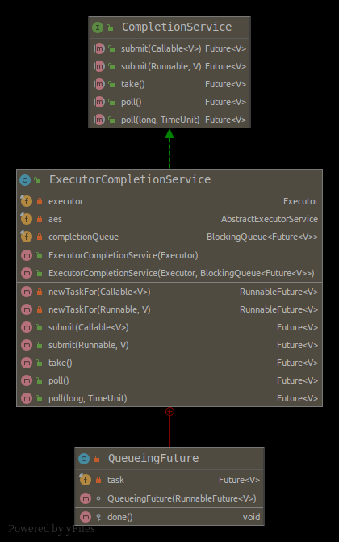

# 【Java】JUC - CompletionService : Executor与BlockingQueue


## 场景一 加载配置
假设我们需要在启动的时候执行`loadConfiguration()`,`loadUsers()`,`loadOrders()`去加载对应的配置

当我们直接按照顺序执行时:
```java
public class DataLoader {
    public void load(){
        long startTime = System.currentTimeMillis();
        loadConfiguration();
        loadUsers();
        loadOrders();
        long endTime = System.currentTimeMillis();
        System.out.printf("load() 总耗时： %d ms \n",endTime -startTime);
    }

    final void loadConfiguration(){
        // 假设加载配置要1S
        loadMock("loadConfiguration()",1);
    }

    final void loadUsers(){
        // 假设加载用户信息要2s
        loadMock("loadUsers()",2);
    }

    final void loadOrders(){
        // 假设加载订单列表要3s
        loadMock("loadOrders()",3);
    }

    private void loadMock(String source, int second) {
        try {
            long startTime = System.currentTimeMillis();
            long milliseconds = TimeUnit.SECONDS.toMillis(second);

            // 模拟任务执行
            Thread.sleep(milliseconds);

            long endTime = System.currentTimeMillis();
            System.out.printf("[线程： %s] %s 耗时: %d ms \n",
                    Thread.currentThread().getName(),source,endTime-startTime);

        } catch (InterruptedException e) {
            e.printStackTrace();
        }
    }


    public static void main(String[] args) {
        new DataLoader().load();
        // [线程： main] loadConfiguration() 耗时: 1001 ms
        // [线程： main] loadUsers() 耗时: 2000 ms
        // [线程： main] loadOrders() 耗时: 3000 ms
        // load() 总耗时： 6048 ms         
    }
}
```

采用`ExecutorCompletionService`处理:
```java
public class ParallelDataLoader extends DataLoader {
    @Override
    public void load() {
        long start = System.currentTimeMillis();
        // 这里是有顺序的,可以调整ThreadPool的核心数,以及submit()的顺序观察
        ExecutorService executorService = Executors.newFixedThreadPool(3);
        CompletionService<ParallelDataLoader> completionService = new ExecutorCompletionService<>(executorService);
        completionService.submit(super::loadConfiguration, null);
        completionService.submit(super::loadUsers, null);
        completionService.submit(super::loadOrders, null);


        int count = 0;
        while (count < 3) {
            // 移除队列,模拟轮询获取返回
            if (completionService.poll() != null) {
                count++;
            }
        }
        executorService.shutdown();
        long end = System.currentTimeMillis();
        System.out.printf("load() 总耗时： %d ms \n", end - start);
    }

    public static void main(String[] args) {
        new ParallelDataLoader().load();
        //[线程： pool-1-thread-1] loadConfiguration() 耗时: 1001 ms
        //[线程： pool-1-thread-2] loadUsers() 耗时: 2000 ms
        //[线程： pool-1-thread-3] loadOrders() 耗时: 3000 ms
        //load() 总耗时： 3089 ms
    }
}
```