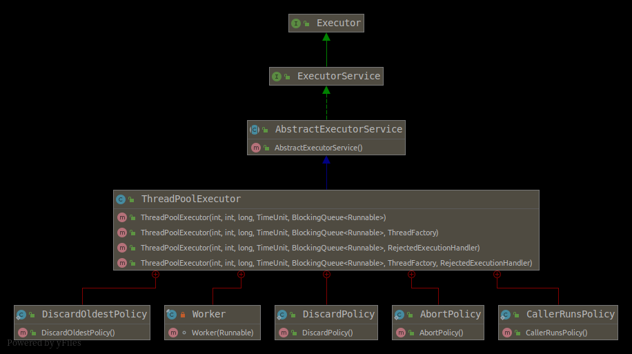

# JUC - ThreadPoolExecutor



## 创建一个ThreadPoolExecutor
```java
ThreadPoolExecutor(
int corePoolSize, // 保留在池中的线程数,即使空闲了也保留(除非设置了{@code allowCoreThreadTimeOut})
int maximumPoolSize, // 池中允许的最大线程数
long keepAliveTime, // 当maximumPoolSize>corePoolSize时,多余空闲线程等待任务的时间
TimeUnit unit, // {@code keepAliveTime}参数的时间单位
BlockingQueue<Runnable> workQueue, // 在task执行之前暂存task.队列只接纳被 {@code execute}方法提交的{@code Runnable}task
ThreadFactory threadFactory, // 创建执行task线程的工厂
RejectedExecutionHandler handler // 如果达到线程界限或者队列容量,拒绝任务执行的处理
) 
```

### 参数限制
- 满足以下条件之一则抛出**IllegalArgumentException**
  - corePoolSize < 0
  - keepAliveTime < 0
  - maximumPoolSize <= 0
  - maximumPoolSize < corePoolSize
- 抛出**NullPointerException**  
  - threadFactory == null
  - handler  == null

### 参数补充说明
- corePoolSize : 如果当前线程总数小于`corePoolSize`，则新建的是**核心线程**，如果超过`corePoolSize`，则新建的是**非核心线程**
- keepAliveTime : 指该线程池中**非核心线程**闲置超时时长, 超过这个参数所设定的时长，就会被销毁掉, 如果设置`allowCoreThreadTimeOut = true`，则会作用于**核心线程**
- unit : TimeUnit时间
- maximumPoolSize : 线程总数 = 核心线程数 + 非核心线程数
- workQueue : 当**核心线程**都在工作时,新添加的任务会被添加到这个队列中等待处理，如果**队列满了**，则新建**非核心线**程执行任务
  - ArrayBlockingQueue : 构造函数一定要传大小
  - LinkedBlockingQueue : 构造函数不传大小会默认为`Integer.MAX_VALUE`，当大量请求任务时，容易造成内存耗尽.由于这个队列没有最大值限制，即所有超过核心线程数的任务都将被添加到队列中，这也就导致了maximumPoolSize的设定失效，因为总线程数永远不会超过corePoolSize
  - SynchronousQueue : 同步队列，一个没有存储空间的阻塞队列 ，将任务同步交付给工作线程.此队列通常要求无界 maximumPoolSizes 以避免拒绝新提交的任务
  - PriorityBlockingQueue : 优先队列
  - DelayQueue : 传进去的任务必须先实现Delayed接口。这个队列接收到任务时，首先先入队，只有达到了指定的延时时间，才会执行任务
- threadFactory : 线程工厂(默认值`Executors.defaultThreadFactory()`)
- handler  : 拒绝策略
  - AbortPolicy(默认) : 直接抛弃
  - CallerRunsPolicy : 拒绝这个任务，不在ThreadPoolExecutor线程池中的线程中运行，而是调用当前线程池的所在的线程去执行被拒绝的任务
  - DiscardOldestPolicy : 抛弃队列中最久的任务（最先加入队列的任务）,再把这个新任务添加到队列中去。
  - DiscardPolicy : 线程池默默丢弃这个被拒绝的任务，不会抛出异常。

### 执行过程
- 1.当线程池小于corePoolSize时，新提交任务将创建一个新线程执行任务，即使此时线程池中存在空闲线程。 
- 2.当线程池达到corePoolSize时，新提交任务将被放入workQueue中，等待线程池中任务调度执行 
- 3.当workQueue已满，且maximumPoolSize>corePoolSize时，新提交任务会创建新线程执行任务 
- 4.当提交任务数超过maximumPoolSize时，新提交任务由RejectedExecutionHandler处理 
- 5.当线程池中超过corePoolSize线程，空闲时间达到keepAliveTime时，关闭空闲线程 
- 6.当设置allowCoreThreadTimeOut(true)时，线程池中corePoolSize线程空闲时间达到keepAliveTime也将关闭 