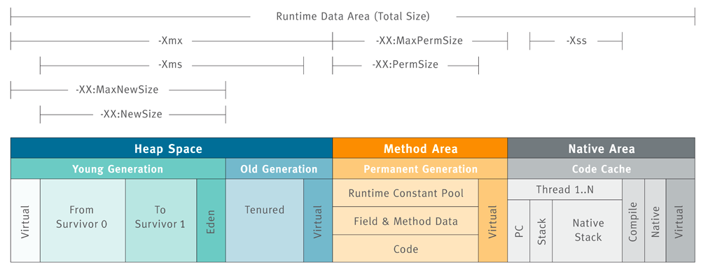

# JVM中的GC垃圾回收

推荐阅读

[Java Garbage Collection handbook](https://plumbr.io/java-garbage-collection-handbook)

[java.lang.OutOfMemoryError](https://plumbr.io/outofmemoryerror)


## What Is Garbage Collection?

> Garbage Collection is tracking down(追踪) all the objects that are still used and marks the rest as garbage.

`memory leak(内存泄露):`该内存被声明但未被使用

**Reference Counting(引用计数)**:

可能存在循环引用问题


**Mark and Sweep(标记清除):**

Garbage Collection Roots(GC Root):
- Local variables(局部变量)
- Active threads(活动线程)
- Static fields(静态字段)
- JNI references(Java Native Interface引用)

`JVM`用于跟踪所有可到达（活动）对象并确保被非可访问对象(non-reachable)声明的内存可重用的方法称为标记和清除算法

它包括两个步骤：
- **Marking(标记)** 正在遍历所有可到达的对象，从GC根目录开始，并在所有此类对象的本机内存(native memory)中保留分类帐(ledger)
- **Sweeping(扫描)** 确保了不可访问对象占用的内存地址可以在下一个分配中重用。

JVM中不同的GC算法，例如`Parallel Scavenge`，`Parallel Mark + Copy或CMS`，在实现这些阶段时略有不同，但是在概念上，该过程仍然类似于上述两个步骤。


## JVM Architecture Diagram




JVM被划分为三个主要的子系统
- 类装载子系统（Class Loader Subsystem）
- 运行时数据区（Runtime Data Area）
- 执行引擎（Execution Engine）

## STW - Stop The World
`Java`中`Stop-The-World`机制简称`STW`，是在执行垃圾收集算法时，`Java`应用程序的其他所有线程都被挂起（除了垃圾收集帮助器之外）。`Java`中一种全局暂停现象，全局停顿，所有`Java`代码停止，`native`代码可以执行，但不能与`JVM`交互。

除了`GC`，`JVM`下还会发生停顿现象:

`JVM`里有一条特殊的线程－－`VM Threads`，专门用来执行一些特殊的`VM Operation`，比如分派`GC`，`thread dump`等，这些任务，都需要整个`Heap`，以及所有线程的状态是静止的，一致的才能进行。所以`JVM`引入了安全点(`Safe Point`)的概念，想办法在需要进行`VM Operation`时，通知所有的线程进入一个静止的安全点。

除了`GC`，其他触发安全点的`VM Operation`包括：
- 1. JIT相关，比如`Code deoptimization, Flushing code cache`；
- 2. `Class redefinition (e.g. javaagent，AOP代码植入的产生的instrumentation)`；
- 3. `Biased lock revocation` 取消偏向锁；
- 4. `Various debug operation (e.g. thread dump or deadlock check)`；

### 参考

[现代JVM中的Safe Region和Safe Point到底是如何定义和划分的?](https://www.zhihu.com/question/29268019/answer/43762165)

## Garbage Collection in Java

### Fragmenting and Compacting(碎片和压缩)
每当进行扫描时，`JVM`必须确保填充有无法访问对象的区域可以重用。这可能会（最终将导致）内存碎片，这与磁盘碎片类似，会导致两个问题：

- 写操作变得更加耗时，因为找到下一个足够大的空闲块不再是微不足道的操作。
- 创建新对象时，`JVM`会在连续的块中分配内存。因此，如果碎片升级到没有任何单独的碎片足以容纳新创建的对象的程度，则会发生分配错误。

为了避免此类问题，`JVM`确保碎片不会失控。因此，在垃圾回收过程中还会发生`“内存碎片整理”`过程，而不仅仅是标记和清除。此过程将所有可到达的对象彼此相邻放置，从而消除（或减少了）碎片。这是一个说明：


### Generational Hypothesis(世代假说)
>  `Weak Generational Hypothesis`(弱代假说):大部分对象的生命期很短（`die young`），而没有`die young`的对象则很可能会存活很长时间（`live long`）

如前所述，执行垃圾回收需要完全停止应用程序。同样很明显，对象越多，收集所有垃圾所需的时间就越长。但是，如果我们有可能使用较小的内存区域怎么办？在研究可能性时，一组研究人员观察到，应用程序内部的大多数分配都分为两类：

- 大多数对象很快就变得不被使用
- 还有一部分不会立即无用,但也不会持续(太)长时间

这些观测形成了 `弱代假设(Weak Generational Hypothesis)`。基于这一假设, VM中的内存被分为`年轻代(Young Generation)`和`老年代(Old Generation)`。老年代有时候也称为 `年老区(Tenured)`。


拆分为这样两个可清理的单独区域，允许采用不同的算法来大幅提高GC的性能。

这种方法也不是没有问题。例如，在不同分代中的对象可能会互相引用, 在收集某一个分代时就会成为 “事实上的” GC root(‘defacto’ GC roots)。

当然,要着重强调的是,分代假设并不适用于所有程序。因为GC算法专门针对`“要么死得快”，“否则可能永远活着”` 这类特征的对象来进行优化, JVM对收集那种存活时间半长不长的对象就显得非常尴尬了。

### Memory Pools(内存池划分)
应该熟悉堆中以下内存池的划分。不太容易理解的地方在于各个内存池中的垃圾收集是如何运行的。注意，在不同的GC算法中，一些实现细节可能有所不同，但是本章中的概念实际上仍然相同。


#### Eden
`Eden` 是内存中的一个区域, 用来分配新创建的对象。

由于通常有多个线程同时创建许多对象，因此`Eden`进一步分为一个或多个,驻留在`Eden`空间中的**Thread Local Allocation Buffer(TLAB for short)线程本地分配缓冲区简称TLAB）**
.通过这种缓冲区划分,大部分对象直接由`JVM`在对应线程的`TLAB`中分配, 避免与其他线程的同步操作。

如果无法在`TLAB`内部进行分配（通常是因为那里没有足够的空间），则分配将转移到共享的Eden空间。如果那里没有足够的空间，则会触发`Young Generation`中的垃圾收集过程以释放更多空间。
如果`Young GC`也没有在`Eden`内部产生足够的可用内存，则该对象将分配到`老年代空间(Old Generation)`。

当`Eden`区进行垃圾收集时, `GC`会从`根(Roots)目录`遍历所有可到达的对象并将它们标记为`存活(alive)`。

我们曾指出,对象间可能会有`跨代的引用`, 所以需要一种方法来标记检查从其他分代中指向`Eden`的所有引用。但是这样做将和世代相传的初衷不合.`JVM`有一个技巧：`卡片标记(card-marking)`。本质上，`JVM`只是在`Eden`中标记了“脏”对象的粗略位置，这些对象可能与上一代有链接。更多参考[the-jvm-write-barrier-card-marking](http://psy-lob-saw.blogspot.com/2014/10/the-jvm-write-barrier-card-marking.html)


标记阶段完成后，将`Eden`中的所有活动对象复制到`幸存者区(Survivor spaces)之一`。现在，整个`Eden`被认为是空的，可以重新使用以分配更多对象。这种方法称为`“标记-复制”(Mark and Copy)`：标记活动对象，然后将其复制（而不移动）到幸存者空间。

#### Survivor Spaces
`Eden`区的旁边是两个`幸存区(Survivor Spaces)`, 称为 `from 空间`和 `to 空间`,**重要的是要注意两个幸存者空间之一始终是空的**。

空的那个幸存者空间用于在下一次`Young GC`时存放收集的对象。整个`年轻代(Young)`的所有活动对象（包括`Eden空间`和`非空的“from”生存空间`）都被复制到`“ to”生存空间`。`GC`过程完成后, `to区`有对象,而 `from区`里没有对象。两者的角色进行正好切换 。


在两个幸存者空间之间复制活动对象的过程重复进行多次，直到某些对象被认为已经成熟并且“足够旧”为止。请记住，基于世代假设，存活了一段时间的对象预计将继续使用很长时间。

这类“ 年老” 的对象因此被`晋升(promoted)`到`Tenured老年代(Old space)`。提升的时候， 幸存者空间的对象不再是复制到另一个幸存者空间,而是迁移到`Tenured老年代(Old space)`, 并在`Tenured老年代(Old space)`一直驻留, 直到变为不可达对象。

为了确定对象是否“足够老”，可以认为已准备好传播到旧空间，`GC`会跟踪集合中特定对象的幸存次数。在每一代对象完成了`GC`之后，那些仍然存在的对象的年龄就会增加。只要年龄超过某个使用  `tenuring threshold(期限阈值)`，  该对象就会被`晋升(promoted)`到旧空间(Old space)。

具体的提升阈值由`JVM`动态调整,但也可以用参数 `-XX:+MaxTenuringThreshold` 来指定上限。如果设置 `-XX:+MaxTenuringThreshold=0` , 则`GC`时存活对象不在存活区之间复制，直接提升到`Old Generation`。现代 `JVM` 中这个阈值默认设置为`15个GC周期`。这也是`HotSpot`中的最大值。

如果幸存者空间的大小不足以容纳`Young一代`中的所有活动对象，那么晋升也可能过早地发生。

#### Old Generation
`Old Generation`内存空间的实现要复杂得多。`Old Generation`通常更大，并且被不太可能成为垃圾的对象所占据。

与`Young Generation`相比，`Old Generation`中发生`GC`的频率更低。此外，由于大多数对象在`Old Generation`中都还活着，因此不会发生 `Mark and Copy (标记和复制)`事件。相反，对象会四处移动以最大程度地减少碎片。清理`Old space`的算法通常建立在不同的基础上。原则上，采取的步骤如下：
- 通过`标志位(marked bit)`,标记所有通过 `GC roots` 可达的对象.
- 删除所有不可达对象
- 通过将活动对象`连续复制`到老年代空间的开头来压缩老年代空间的内容

通过上面的描述可知, 老年代`GC`必须明确地进行整理,以避免内存碎片过多。

#### PermGen
在`Java 8`之前有一个特殊的空间,称为`永久代(Permanent Generation)`。这是`元数据(metadata)`比如`classes`所在之处.此外，`Permgen`还保留了一些其他内容，例如`内部字符串(internalized strings)`。实际上这给Java开发者造成了很多麻烦,因为很难去计算这块区域到底需要占用多少内存空间。预测失败导致的结果就是产生 `java.lang.OutOfMemoryError: Permgen space` 这种形式的错误。
除非`OutOfMemoryError`确实是内存泄漏导致的,否则就只能增加`permgen`的大小，例如下面的示例，就是设置`permgen`最大空间为 256 MB:
```bash
java -XX：MaxPermSize = 256m com.mycompany.MyApplication
```

#### Metaspace
由于预测对元数据的需求是一项复杂且不便的工作，因此在`Java 8`中删除了`Permanent Generation`，转而支持`Metaspace`。从那时起，大多数杂项都移到了常规`Java堆`中。

当然，像`类定义(class definitions)`之类的信息会被加载到 `Metaspace` 中。元数据区位于本地内存`(native memory)`,不再影响到堆中的普通的Java对象.默认情况下，`Metaspace`大小仅受Java进程可用的本机内存量限制.这样程序就不再因为多加载了几个类/JAR包就导致 `java.lang.OutOfMemoryError: Permgen space.`注意, 这种不受限制的空间也不是没有代价的 —— 如果 `Metaspace` 失控, 则可能会导致很严重的内存交换(swapping), 或者导致本地内存分配失败。

如果您仍然希望在这种情况下保护自己，则可以像下面这样限制`Metaspace`的增长，将`Metaspace`的大小限制为256 MB：
```bash
java -XX:MaxMetaspaceSize=256m com.mycompany.MyApplication
```

### 参考
[Garbage Collection in Java](https://plumbr.io/handbook/garbage-collection-in-java)

[java的gc为什么要分代？](https://www.zhihu.com/question/53613423)

## JVM Garbage Collectors


|  收集器   | 收集范围  | 算法  | 执行类型  |备注  |
|  ----  | ----  |----  |----  |----  |
| `Serial(串行GC)`  | 新生代 |复制 |单线程 |Jvm client模式下默认的新生代收集器|
| `ParNew(并行GC)`  | 新生代 |复制 |多线程并行 |serial收集器的多线程版本|
| `Parallel Scavenge(并行回收GC)`  | 新生代 |复制 |多线程并行 |目标是达到一个可控制的吞吐量<br>吞吐量= 程序运行时间/(程序运行时间 + 垃圾收集时间)<br>虚拟机总共运行了100分钟。其中垃圾收集花掉1分钟，那吞吐量就是99%。|
| `Serial Old(串行GC)`  | 老年代 |标记整理 |单线程 |Serial收集器的老年代版本<br>主要使用在Client模式下的虚拟机|
| `Parallel Old(并行GC)` | 老年代 |标记整理 |多线程并行 |Parallel Scavenge收集器的老年代版本|
| `CMS(并发GC)` | 老年代 |标记清除 |多线程并发 |以获取最短回收停顿时间为目标的收集器|
| `G1` | 全部 |复制算法,标记整理 |多线程 |以获取最短回收停顿时间为目标的收集器|

> `并行(Parallel)`：多条垃圾收集线程并行工作，而用户线程仍处于等待状态  
> `并发(Concurrent)`：垃圾收集线程与用户线程一段时间内同时工作(交替执行)

### 参考
[JVM GC参数以及GC算法的应用](https://my.oschina.net/hosee/blog/644618)

[JVM GC算法](https://cloud.tencent.com/developer/article/1102243)

[java虚拟机之HotSpot垃圾收集器](https://www.toutiao.com/i6490796229067276814/)

[Java虚拟机学习 - 垃圾收集器](https://blog.csdn.net/java2000_wl/article/details/8030172)

