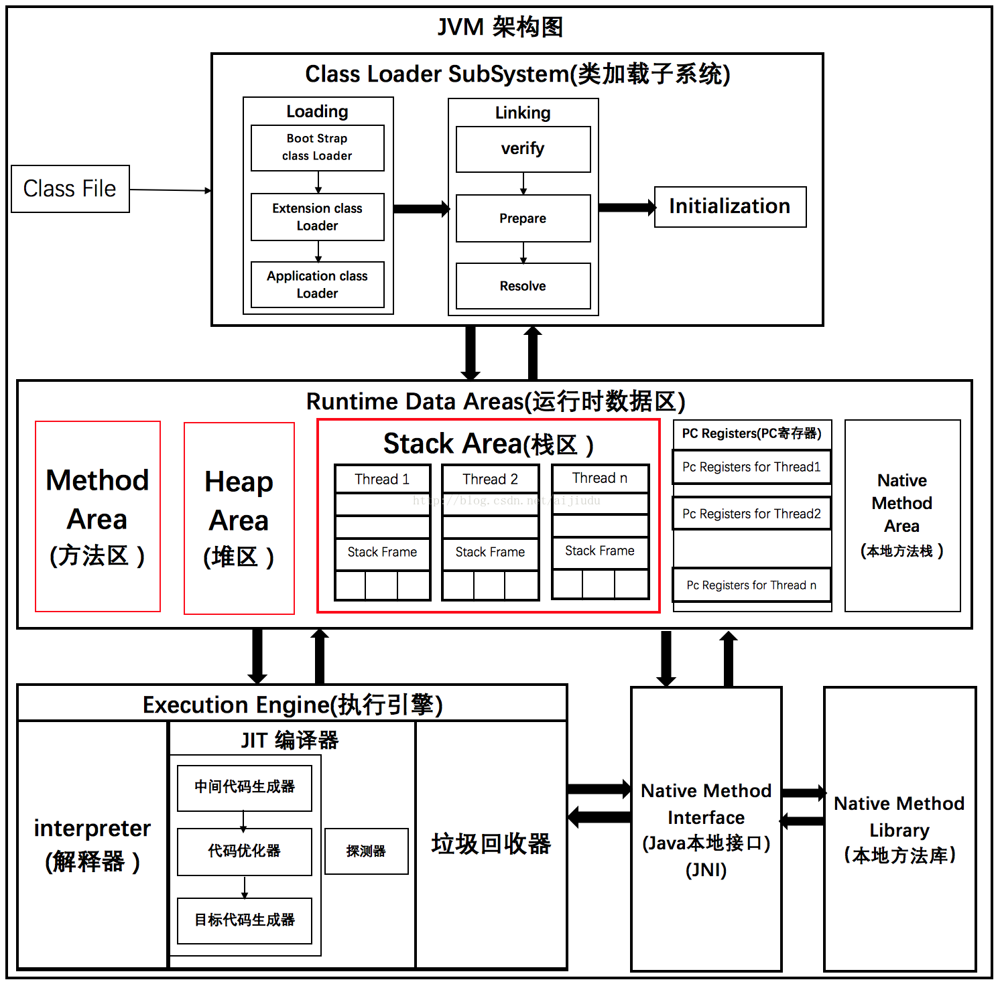

# JVM架构图

参考博客: [JVM架构和GC垃圾回收机制(JVM面试不用愁)](https://blog.csdn.net/aijiudu/article/details/72991993)

JVM被划分为三个主要的子系统

- 类装载子系统（Class Loader Subsystem）
- 运行时数据区（Runtime Data Area）
- 执行引擎（Execution Engine）