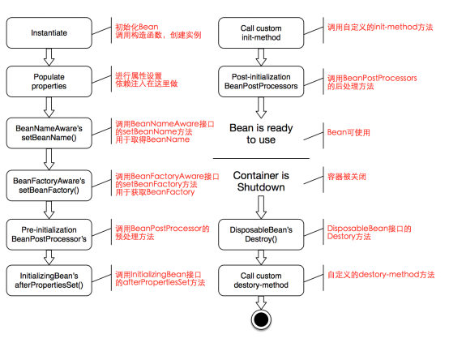

# Spring Bean的一生

> When you work directly in Java, you can do anything you like with your objects and do not always need to rely on the container lifecycle.


**前言:**  

在Ioc容器启动后相应的Bean并没有立即实例化，此时Ioc容器仅仅拥有所有对象的`BeanDefinition(Bean对象在Spring中的描述,包含该Bean在容器中实例化所需的信息，通过解析xml/javaconfig后所得)`

## Spring Bean生命周期的管理

`Spring bean factory`能管理`Beans`的生命周期，通过实现**InitializingBean**和**DisposableBean**

这两个接口都只声明一个方法让我们可以`初始化/关闭`bean中的资源

当然在整个生命周期中也提供了一些**Call Back Methods**,这些方法类似于`Servlet`中的监听器的实现

- 当`Bean`处于`post-initialization`阶段时，我们可以通过实现`InitializingBean`接口来实现`afterPropertiesSet()`
- 当`Bean`处于`pre-destruction `阶段时，我们可以实现`DisposableBean `接口来实现`destroy()`方法

### Spring Bean的生命周期图




## Code Time

以`Rick`类交给Spring容器管理，方法顺序为其在Spring容器中的执行顺序

**Rick.java**
```java
public class Rick implements InitializingBean, DisposableBean {
    public Rick(){
        System.out.println("Rick is in [Rick] - Rick()");
    }

    public void customInit(){
        System.out.println("Rick is in [Rick] - customInit()");
    }

    @PostConstruct
    public void postConstruct(){
        System.out.println("Rick is in [@PostConstruct] - postConstruct()");
    }

    @Override
    public void afterPropertiesSet() throws Exception {
        System.out.println("Rick is in [InitializingBean] - afterPropertiesSet()");
    }

    @PreDestroy
    public void preDestroy(){
        System.out.println("Rick is in [@PreDestroy] - preDestroy()");
    }

    @Override
    public void destroy() throws Exception {
        System.out.println("Rick is in [DisposableBean] - destroy()");
    }

    public void customDestroy(){
        System.out.println("Rick is in [Rick] - customDestroy()");
    }
}
```

加入`BeanPostProcess`

**RickBeanPostProcess.java**
```java
public class RickBeanPostProcess implements BeanPostProcessor {
    @Override
    public Object postProcessBeforeInitialization(Object bean, String beanName) throws BeansException {
        if (bean instanceof Rick) {
            System.out.println("Rick is in [BeanPostProcessor] - postProcessBeforeInitialization()");
        }

        return bean;
    }

    @Override
    public Object postProcessAfterInitialization(Object bean, String beanName) throws BeansException {
        if (bean instanceof Rick) {
            System.out.println("Rick is in [BeanPostProcessor] - postProcessAfterInitialization()");
        }
        return bean;
    }
}
```

配置类

**RickConfig.java**

```java
@Configuration
public class RickConfig {

    /**
     * 指定自定义初始化方法和自定义销毁方法
     * @return Rick
     */
    @Bean(initMethod = "customInit",destroyMethod = "customDestroy")
    public Rick rick(){
        return new Rick();
    }

    @Bean
    public RickBeanPostProcess rickBeanPostProcess(){
        return new RickBeanPostProcess();
    }
}
```

测试类

**Client.java**
```java
public class Client {
    public static void main(String[] args) {
        ApplicationContext applicationContext = new AnnotationConfigApplicationContext(RickConfig.class);
        ((AnnotationConfigApplicationContext) applicationContext).close();
    }
}
```


最终结果如下

```bash
Rick is in [Rick] - Rick()
Rick is in [BeanPostProcessor] - postProcessBeforeInitialization()
Rick is in [@PostConstruct] - postConstruct()
Rick is in [InitializingBean] - afterPropertiesSet()
Rick is in [Rick] - customInit()
Rick is in [BeanPostProcessor] - postProcessAfterInitializa
Rick is in [@PreDestroy] - preDestroy()
Rick is in [DisposableBean] - destroy()
Rick is in [Rick] - customDestroy()
```

## 参考
[Spring Framework Documentation](https://docs.spring.io/spring/docs/5.1.8.RELEASE/spring-framework-reference/)

[Spring Bean Life Cycle Explained](https://howtodoinjava.com/spring-core/spring-bean-life-cycle/)

[Spring Bean Life Cycle](https://www.journaldev.com/2637/spring-bean-life-cycle)

[Spring Boot Bean生命周期](https://www.jianshu.com/p/8e2d400492c7)

[Spring的Bean生命周期理解](https://www.cnblogs.com/wgl-gdyuan/p/9911653.html)