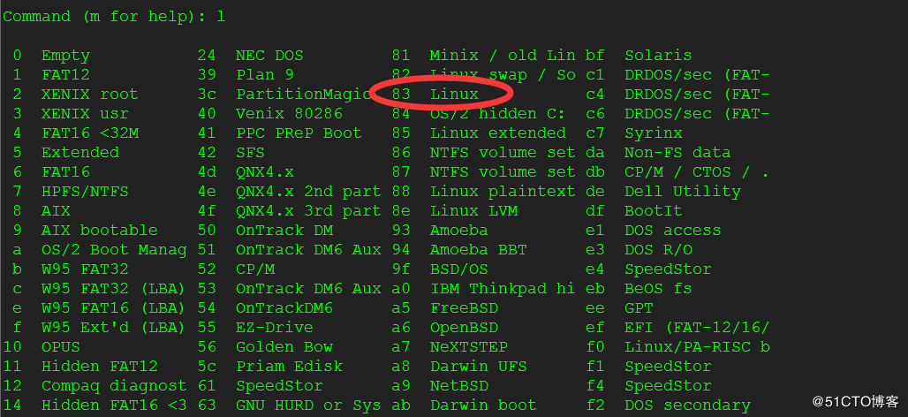

# Linux磁盘挂载

```bash
# 查看磁盘块
lsblk

# 进行分区
fdisk /dev/sdb

```

**命令(输入 m 获取帮助)：m**
```cmd
d:(del)删除一个分区。
n:(new)新建一个新分区。
p:(print)打印分区表。
q:(quit)放弃不保存。
t:改变分区类型
w:(write)把分区写进分区表，保存并退出。
l:列出已挂载的磁盘
```
**命令(输入 m 获取帮助)：n**
```bash
Partition type:
   p   primary (0 primary, 0 extended, 4 free)
   e   extended
Select (default p): 
Using default response p
分区号 (1-4，默认 1)：
起始 扇区 (2048-3221225471，默认为 2048)：
将使用默认值 2048
Last 扇区, +扇区 or +size{K,M,G} (2048-3221225471，默认为 3221225471)：
将使用默认值 3221225471
分区 1 已设置为 Linux 类型，大小设为 1.5 TiB 
```

**保存分区**
```bash
命令(输入 m 获取帮助)：w
The partition table has been altered!

Calling ioctl() to re-read partition table.
```

**检查**
```bash
fdisk -l
```

**进行挂载**
```bash
# 挂载
mount /dev/sdb1 /home/data/


# 检查
df -TH /home/data/

# 系统启动自动挂载 在/etc/fstab下
/dev/sdb1  /home/data ext4  defaults  0  0

# 卸载挂载点
umount /dev/sdb1
```


## 参考

**linux分区类型代码**


[linux下使用fdisk对磁盘进行分区](https://blog.51cto.com/12185273/2048111)