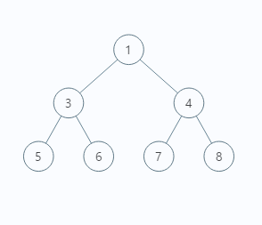

# 二叉树的遍历

**二叉树用例**



**代码解析：**

```java
public class BinaryTree {

    static class TreeNode {
        Integer val;
        TreeNode left;
        TreeNode right;

        public TreeNode(Integer val) {
            this.val = val;
        }
    }

    public static TreeNode init(Integer[] arr, int index) {
        TreeNode node = null;
        if (index < arr.length) {
            node = new TreeNode(arr[index]);
            node.left = init(arr, 2 * index + 1);
            node.right = init(arr, 2 * index + 2);
        }
        return node;
    }

    private static List<Integer> list = new ArrayList<>(10);

    public static void main(String[] args) {
        Integer[] arr = new Integer[]{1, 3, 4, 5, 6, 7, 8};

        System.out.println("递归实现前序遍历：   "+ rootLeftRightRecursive(init(arr,0)));
        list.clear();
        System.out.println("非递归实现前序遍历： "+ rootLeftRightNonRecursive(init(arr,0)));
        list.clear();

        System.out.println();

        System.out.println("递归实现中序遍历：   "+ leftRootRightRecursive(init(arr,0)));
        list.clear();
        System.out.println("非递归实现中序遍历： "+ leftRootRightNonRecursive(init(arr,0)));
        list.clear();

        System.out.println();

        System.out.println("递归实现后序遍历：   "+ leftRightRootRecursive(init(arr,0)));
        list.clear();
        System.out.println("非递归实现后序遍历： "+ leftRightRootNonRecursive(init(arr,0)));
        list.clear();

        System.out.println();

        System.out.println("层次遍历： "+ levelOrder(init(arr,0)));

        System.out.println();

        System.out.println("树的深度为： "+ depth(init(arr,0)));


    }


    /**
     * 递归实现前序遍历
     * 中-左-右
     * @param node TreeNode
     * @return List
     */
    public static List rootLeftRightRecursive(TreeNode node) {
        if (null != node){
            list.add(node.val);
            rootLeftRightRecursive(node.left);
            rootLeftRightRecursive(node.right);
        }
        return list;
    }

    /**
     * 非递归实现前序遍历
     * 中-左-右
     * @param node TreeNode
     * @return List
     */
    public static List rootLeftRightNonRecursive(TreeNode node) {
        Stack<TreeNode> stack = new Stack<>();
        TreeNode cur = node;

        while (null != cur || !stack.isEmpty()) {
            if (null != cur) {
                list.add(cur.val);
                stack.push(cur);
                cur = cur.left;

            } else {
                cur = stack.pop();
                cur = cur.right;
            }
        }
        return list;
    }

    /**
     * 递归实现中序遍历
     * 左-中-右
     * @param node TreeNode
     * @return List
     */
    public static List leftRootRightRecursive(TreeNode node) {
        if (null!=node){
            leftRootRightRecursive(node.left);
            list.add(node.val);
            leftRootRightRecursive(node.right);
        }
        return list;
    }

    /**
     * 非递归实现中序遍历
     * 左-中-右
     * @param node TreeNode
     * @return List
     */
    public static List leftRootRightNonRecursive(TreeNode node) {
        List<Integer> list = new ArrayList<>(10);
        Stack<TreeNode> stack = new Stack<>();
        TreeNode cur = node;

        while (null != cur || !stack.isEmpty()) {
            if (null != cur) {
                stack.push(cur);
                cur = cur.left;
            } else {
                cur = stack.pop();
                list.add(cur.val);
                cur = cur.right;
            }
        }

        return list;
    }

    /**
     * 递归实现后序遍历
     * 左-右-中
     * @param node TreeNode
     * @return List
     */
    public static List leftRightRootRecursive(TreeNode node){

        if (null!=node){
            leftRightRootRecursive(node.left);
            leftRightRootRecursive(node.right);
            list.add(node.val);
        }
        return list;
    }

    /**
     * 非递归实现后序遍历
     * 左-右-中
     * @param node TreeNode
     * @return List
     */
    public static List leftRightRootNonRecursive(TreeNode node){
        if (null == node){
            return list;
        }
        Stack<TreeNode> stack = new Stack<>();
        stack.push(node);
        TreeNode cur;

        while (!stack.isEmpty()){
            cur = stack.pop();
            if (cur.left!=null){
                stack.push(cur.left);
            }
            if (cur.right!=null){
                stack.push(cur.right);
            }
            // 逆序添加
            list.add(0,cur.val);
        }
        return list;
    }

    /**
     * 层序遍历队列实现（广度优先算法BFS）
     * @param root TreeNode
     * @return List
     */
    public static List<List<Integer>> levelOrder(TreeNode root){
        List<List<Integer>> list = new ArrayList<>();
        if(root == null){
            return list;
        }

        Queue<TreeNode> queue = new LinkedList<>();
        queue.add(root);

        while(!queue.isEmpty()){
            int count = queue.size();
            List<Integer> tmpList = new ArrayList<>();
            while(count > 0){
                TreeNode node = queue.poll();
                tmpList.add(node.val);
                if(node.left!=null){
                    queue.add(node.left);
                }
                if(node.right!=null){
                    queue.add(node.right);
                }
                count--;
            }
            list.add(tmpList);
        }
        return list;
    }


    /**
     * 递归实现获取树的深度
     * @param node TreeNode
     * @return int
     */
    public static int depth(TreeNode node){
        if (node == null){
            return 0;
        }
        int left = depth(node.left);
        int right = depth(node.right);

        return left > right ? left + 1 : right + 1;
    }

}
```

**结果为：**

```bash
递归实现前序遍历：   [1, 3, 5, 6, 4, 7, 8]
非递归实现前序遍历： [1, 3, 5, 6, 4, 7, 8]

递归实现中序遍历：   [5, 3, 6, 1, 7, 4, 8]
非递归实现中序遍历： [5, 3, 6, 1, 7, 4, 8]

递归实现后序遍历：   [5, 6, 3, 7, 8, 4, 1]
非递归实现后序遍历： [5, 6, 3, 7, 8, 4, 1]

层次遍历： [[1], [3, 4], [5, 6, 7, 8]]

树的深度为： 3
```